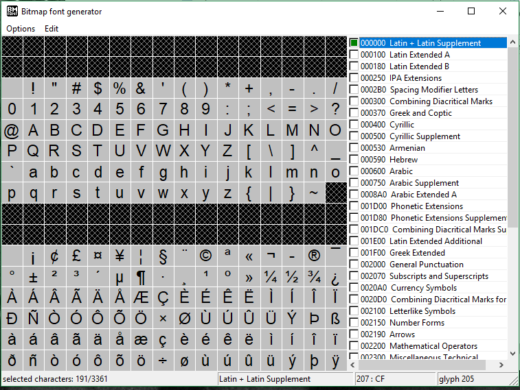
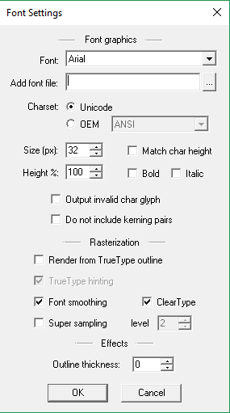
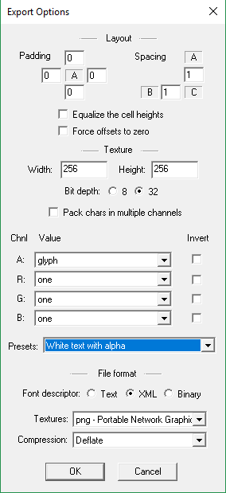
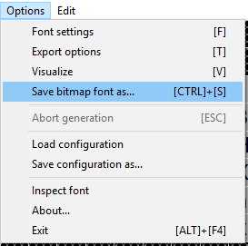

# Bitmap Font Generator

Vamos agora trabalhar um pouco com o Bitmap Font Generator. Vá até o site do aplicativo, faça o download e instale. A instalação é muito corriqueira e não há necessidade de entrarmos em detalhes aqui.
Par baixar o aplicativo acesse ``https://www.angelcode.com/products/bmfont``

Depois de instalado abra o aplicativo e vamos ver os tópicos essenciais para gerar nossas bitmap fontes.

A primeira coisa a fazer é selecionar o conjunto de caracteres que iremos trabalhar. O primeiro conjunto localizado na parte de cima do lado direito da figura é o ``Latin + Latin Supplement``. Selecionando este conjunto você já terá todos os caracteres alfanuméricos do português e outras línguas latinas.

## Configuração da fonte

Clicando ``Options`` no menu do aplicativo e selecionando ``Font settings`` abre-se a janela de configuração da fonte.

As opções de configuração são auto-explicativas, mas o mais importante aqui é você escolher a fonte na caixa de seleção ``Font``. Nesta caixa você poderá escolher qualquer fonte instalada no sistema. Mas na caixa de seleção logo abaixo, ``Add font file``, você poderá carregar um arquivo de fonte de formato TTF para trabalhar.

## Configuração de exportação

Agora selecionando no menu a opção ``Export Options`` teremos a janela de configuração de exportação da nossa bitmap fonte.

Um pouco acima da metade dessa janela temos a seleção do ``Bit depth``. Selecione 32.
Na caixa de seleção ``Presets`` escolha a opção ``White text with alpha``. Em ``File format`` selecione a opção XML. Na caixa de seleção ``Textures`` selecione o formato ``PNG``.

Com estas configurações iremos exportar uma bitmap fonte com fundo transparente e cor de texto branco. Infelizmente este aplicativo não oferece opções de cor, sombra, stroke e etc como o Littera. Mas particularmente eu prefiro no Phaser usar a técnica de webfonts.

## exportação

Agora vá no menu ``Options`` e exporte a bitmap selecionando ``Save bitmap font as..``. Pronto, não tem segredo. Serão gerados os 2 arquivos da bitmap fonte: o arquivo PNG e o FNT (lembrando que esse fnt é na verdade um XML).
