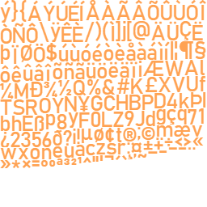
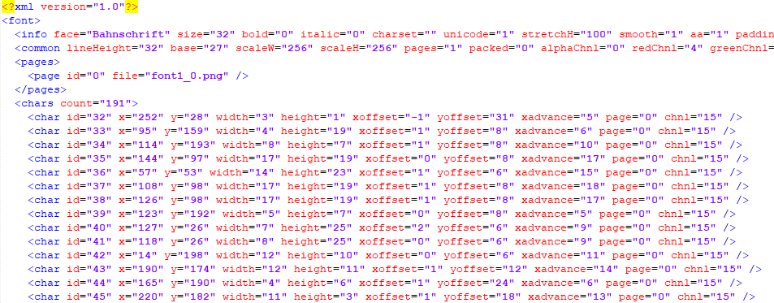

## Bitmap fontes

Bitmap fonte é uma técnica que utiliza 2 arquivos para escrever os caracteres na tela: um arquivo de imagem e um arquivo de texto com o mapeamento dos caracteres dentro do respectivo arquivo de imagem. O arquivo texto pode estar nos formatos XML, JSON ou CSV. Geralmente para o formato XML, temos um arquivo com a extensão FNT.

Por exemplo:

imagem font.png

arquivo xml font.fnt

Bitmap fontes são muito fáceis de serem utilizadas no Phaser
