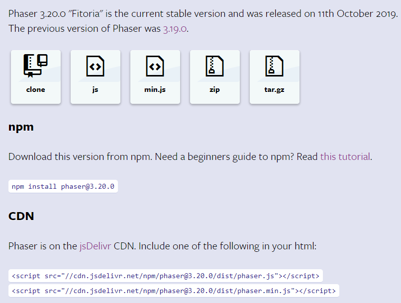
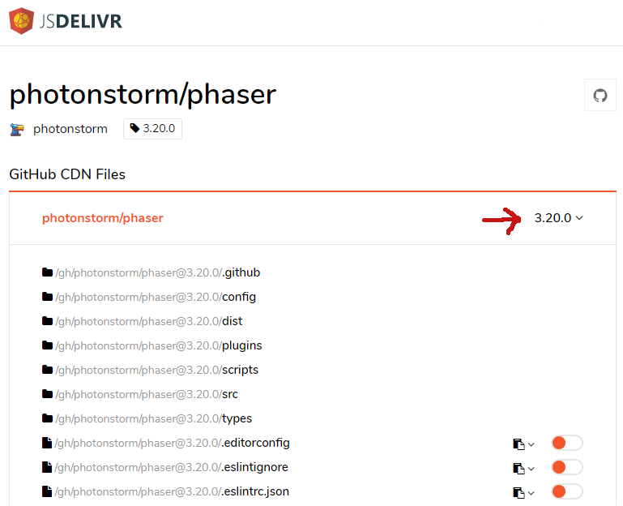

# Prefácio

# Como ler o livro
O código fonte de todos exemplos estão disponíveis no Github [https://github.com/gidenilson/phaser3book](https://github.com/gidenilson/phaser3book)

# Download do Phaser
O Phaser é um framework muito ativo, com várias atualizações por ano. Isso é muito bom pois estamos trabalhando com uma ferramenta em constante desenvolvimento. Por isso para você acompanhar os exemplos desse curso é importante que utilize a mesma versão do Phaser que estamos usando, a 3.20.

Por conveniência em todos exemplos aqui mostrados estamos utilizando o Phaser a partir de um CDN ````

Em desenvolvimento é melhor usar a versão não minificada, para termos a ajuda do Phaser na hora de encontrar algum erro no nosso código.

Para produção, como sempre, usamos a versão minificada a partir do CDN ou baixada diretamente na pasta do no nosso game.

Na página de download do Phaser encontramos todas essas possibilidades.

Se quando você estiver acompanhando este curso a versão do Phaser for diferente da 3.20, você pode escolher a versão acessando o repositório do Phaser no Github, ou escolhendo a versão no CDN do Phaser em <https://www.jsdelivr.com/package/gh/photonstorm/phaser>

