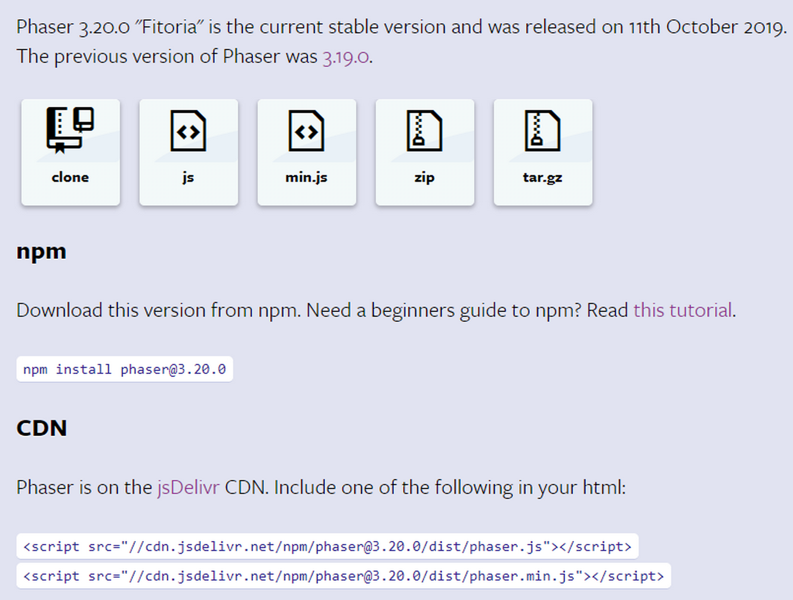
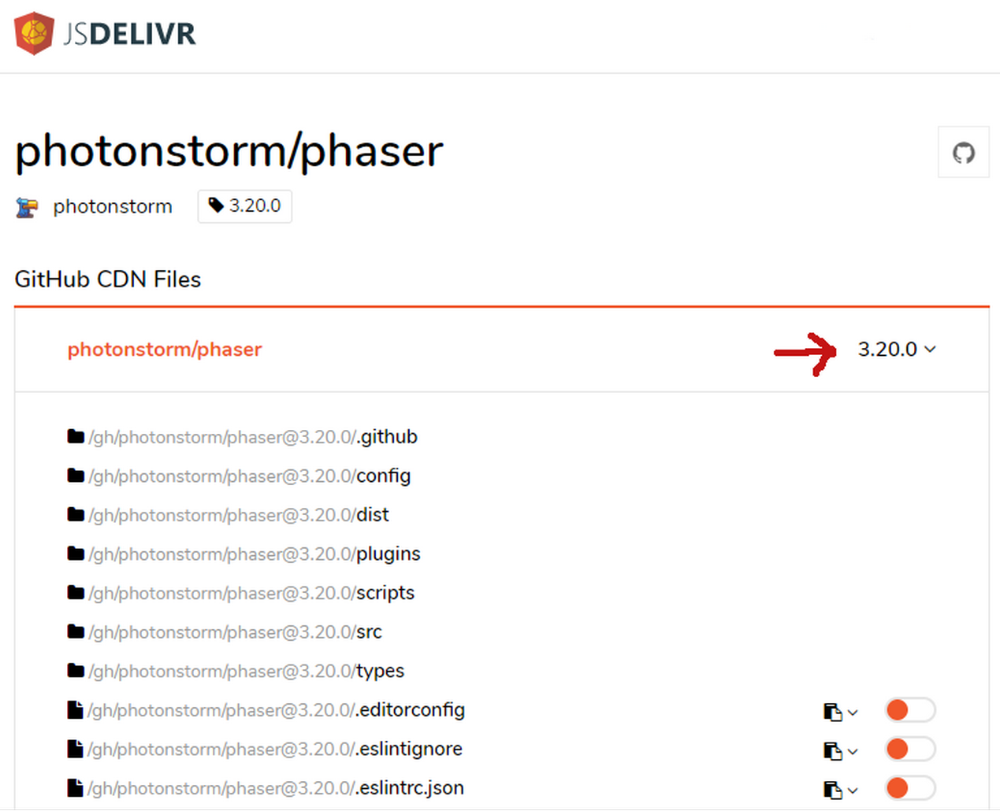

# Autor

Gidenilson Alves Santiago nasceu no 'ano que não acabou' (1968). Aos 15 anos ganhou do seu tipo o microcomputador CP200, com 16K de RAM e processador Z-80. Iniciou seus estudos de programação, aos 15 anos, em BASIC lendo o manual do micro. Ao esgotar o estudo do BASIC partiu para ASSEMBLY Z-80. Seu próximo micro foi o TK2000 da Microdigital que era bem mais poderoso com incríves 64K de RAM e cores. Como já fizera antes, aprendeu a programar o BASIC e depois a linguagem ASSEMBLY do processador 6502.

Desde então o autor vem acompanhando o desenvolvimento da programação, sendo programador backend (PHP) e frontend (Javascript), tendo trabalhado em empresas de software e como freelancer. Atualmente se dedica ao estudo de JavaScript, jogos 2D e jogos educativos com destaque para educação musical.
Paralelamente o autor é músico e habilitado em educação musical pela Universidade Federal de São Carlos - UFSCar.

# Prefácio

Em um mundo de acentuados avanços tecnológicos, um dos mercados que mais cresce é o de jogos eletrônicos. Com isto em vista, mais e mais pessoas se aventuraram no estudo do desenvolvimento de jogos de todos os gêneros, modalidades e em diferentes plataformas. Além de novos jogos, novas formas de desenvolvê-los e projetá-los foram surgindo. Uma destas formas é o uso de frameworks, e neste livro você aprenderá como usar o Phaser para desenvolver seus próprios jogos. A escolha do Phaser é devida ao intuito do autor em usar ferramentas gratuitas, acessíveis a qualquer um que quiser iniciar seus estudos em desenvolvimento de jogos sem gastar muito. Para o autor, usar ferramentas de baixo custo e fácil acesso contribui para a democratização do conhecimento, viabilizando a mais pessoas prosseguirem seus estudos sem se preocupar com grandes gastos em ferramentas de trabalho, pesquisa e lazer. Criar jogos é uma atividade que pode ser muito divertida e cativante, e neste livro você poderá iniciar seus estudos, ou aprender mais sobre esta poderosa ferramenta de criação de jogos que é o Phaser. Bom proveito e boa leitura!

Daniel Lopes Santiago\
*(Gamer Senior)*

# Sobre o livro

O objetivo deste livro é iniciar o leitor na criação de jogos 2D, em HTML2 e Javascript, com o framework Phaser.

Esse livro deve ser lido por quem está pelo menos familiarizado com Javascript nos seguintes aspectos:

1. Orientação a objetos
2. Arow functions
3. Classes e extends

Nos primeiros capítulos estudaremos as principais funcionalidades separadamente para facilitar a assimilação e nos capítulos finais desenvolveremos alguns jogos completos.

## Como ler o livro
O código fonte de todos exemplos estão disponíveis no Github [https://github.com/gidenilson/phaser3book](https://github.com/gidenilson/cursophaser3)

Para tirar o máximo proveito deste livro, meu conselho é que você leia cada capítulo 2 vezes. Faça a primeira leitura sem se preocupar com o completo entendimento do assunto e nem com os códigos mostrados. A segunda leitura deve ser mais lenta e acompanhada do estudo e desenvolvimento do código apresentado. Para ajudas você vai encontrar todos os exemplo prontos no código fonte do livro. Você não precisa necessariamente codificar, pois acredito que o estudo do código pronto é suficiente para aprender a desenvolver com o Phaser. Mas é importante que enquanto aprende você já comece a criar seus próprios exemplos conforme vai ganhando conhecimento.

## Download do Phaser
O Phaser é um framework muito ativo, com várias atualizações por ano. Isso é muito bom pois estamos trabalhando com uma ferramenta em constante desenvolvimento. Por isso para você acompanhar os exemplos desse curso é importante que utilize a mesma versão do Phaser que estamos usando, a 3.20.

Por conveniência em todos exemplos aqui mostrados estamos utilizando o Phaser a partir de um CDN ````

Em desenvolvimento é melhor usar a versão não minificada, para termos a ajuda do Phaser na hora de encontrar algum erro no nosso código.

Para produção, como sempre, usamos a versão minificada a partir do CDN ou baixada diretamente na pasta do no nosso game.

Na página de download do Phaser encontramos todas essas possibilidades.

Se quando você estiver acompanhando este curso a versão do Phaser for diferente da 3.20, você pode escolher a versão acessando o repositório do Phaser no Github, ou escolhendo a versão no CDN do Phaser em <https://www.jsdelivr.com/package/gh/photonstorm/phaser>

