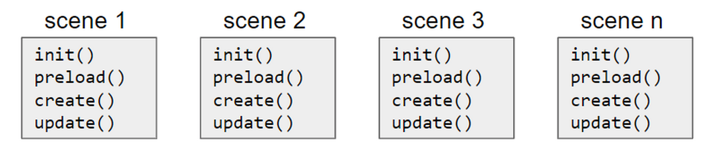
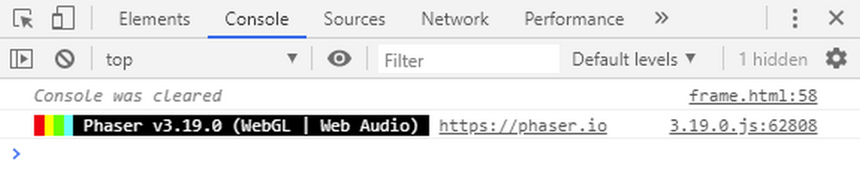

# Fundamentos

## Estrutura de um jogo Phaser
No Phaser um jogo é composto por scenes (cenas), onde cada scene corresponde a uma tela do jogo. É possível navegar facilmente de uma scene para outra. Podemos desenvolver um jogo de forma monolítica, com todo o código dentro de um único arquivo. Para o Phaser não faz diferença se todo o código está em um arquivo só, mas para organização e facilidade de desenvolvimento e manutenção é melhor dividimos o código em blocos menores. Uma primeira divisão a ser feita é criar um arquivo para cada cena e para cada entidade do jogo.
Na figura temos um exemplo de como podemos estruturar as cenas de um jogo. Temos aí um arquivo para cada scene.



Também é um bom momento dizer que todas as scenes do jogo podem ter 4 métodos especiais: ``init(), preload(), create(), update()``.

````javascript
class BootScene extends Phaser.Scene {
  constructor() {
    super('Boot');
  }

  init(){
    // code
  }
  preload() {
    // code
  }

  create() {
    // code
  }
  update(time, delta){
    // code
  }
}
````


O método ``init()`` é o primeiro bloco a ser executado na inicialização da scene. Neste bloco podemos colocar nossas variáveis de inicialização.

O método ``preload()`` é onde os assets do jogo são carregados para o cache do jogo.

O método ``create()`` é executado em seguida do método ``preload()`` e é onde fica a maior parte da lógica do nosso jogo.

Esses 3 métodos são executados uma vez na chamada da scene. Mas o próximo método, ``update()``, é executado repetidamente numa taxa de 60 fps (frames por segundo). É neste método que escrevemos partes da lógica que necessitam atualização a cada frame.

## Código mínimo
Como já dissemos anteriormente, um jogo em Phaser pode ser um único arquivo de código. Vamos então nesse momento ver como fica o código mínimo para um jogo nascer:

````javascript
var config = {
    type: Phaser.AUTO,
    width: 800,
    height: 600,
    scene: {
        create: create
    }
}
var game = new Phaser.Game(config);
function create ()
{
  // code
}
````

Com este código teremos o seguinte na tela:


Ou seja, só uma quadro preto na tela. Mas se abrirmos o console do desenvolvedor no browser veremos que o Phaser já está rodando:



No código acima podemos observar que só temos um objeto de configuração e apenas o método ``create()``. A referência a uma scene está neste arquivo de configuração, mas não temos nenhum outro código designando uma scene. Isso acontece porque com um código mínimo podemos ter apenas uma scene, que será o próprio código.

Os métodos ``init(), preload(), create()``, e ``update()`` não são obrigatórios, mas aparecem só quando necessário.

Para o nosso 'Olá mundo!' podemos escrever o seguinte código:

````javascript
var config = {
  type: Phaser.AUTO,
  scene: {
    create: create
  }
}
var game = new Phaser.Game(config)
function create() {
  this.add.text(400, 300, 'Olá, mundo!')
}
````
Teremos na tela:


