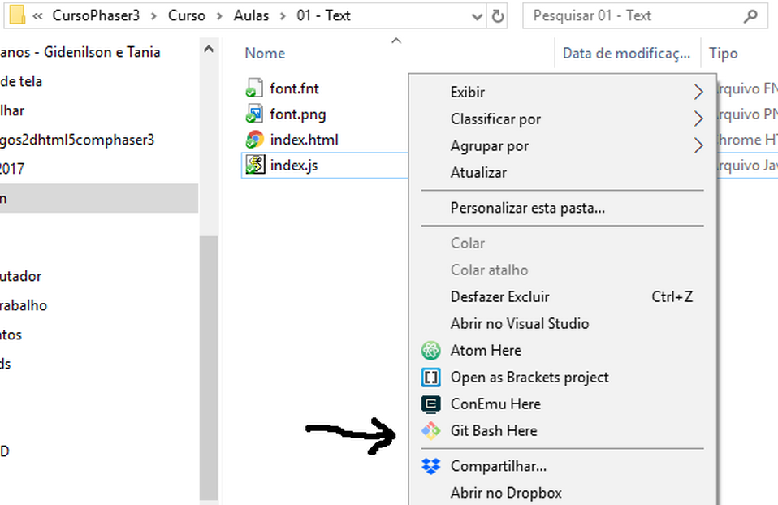
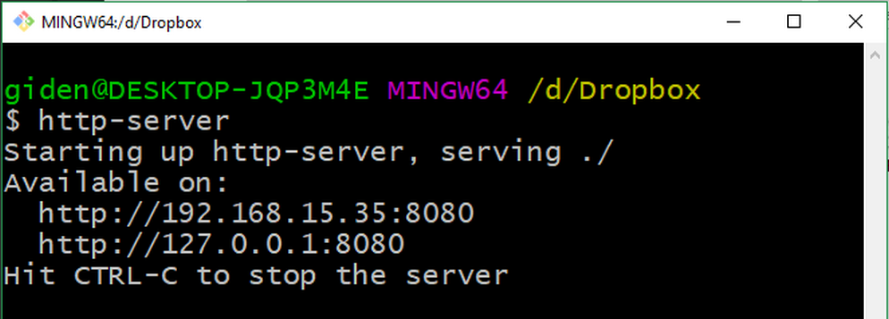

# Preparação do ambiente de desenvolvimento
Para trabalharmos com o Phaser precisaremos ter em nosso computador o GitBash (ou algum outro console de linha de comando), o NodeJs e o script http-server

Precisamos do http-server para servir nossos arquivos localmente na nossa máquina, pois o Javascript, por questões de segurança, não vai ler arquivos diretamente do nosso sistema de arquivos.

Para rodar o http-server precisamos do NodeJs e no npm instalados. E para trabalhar com o NodeJs utilizaremos o console de linha de comando GitBash.

Além desses aplicativos você precisará de um bom editor de texto, dentre as muitas alternativas disponíveis. Use o que achar melhor, mas para este curso estarei utilizando o Atom (https://atom.io).

É claro que você é livre para utilizar outras alternativas à esses aplicativos aqui sugeridos. Mas de qualquer maneira vamos ver como instalar cada um deles para deixar o nosso ambiente pronto para trabalharmos.

## GitBash
Baixe o Git no site https://git-scm.com

Não tem nenhum segredo para instalar o Git (que já vem com o GitBash. Siga as instruções do site.
Se você fez a instalação padrão, o programa de instalação do Git criou um atalho de contexto para abrir o GitBash nas pastas, escolhendo essa opção clicando com o botão direito do mouse.

## NodeJs
A instalação do NodeJs também é corriqueira. Acesse o site, baixe o arquivo de instalação e instale na sua máquina (https://nodejs.org).

## http-server
Já tendo instalado o GitBash e o Nodejs, você já pode instalar o servidor http-server com o comando npm.

Crie uma pasta para o seu projeto e abra o GitBash clicando com o botão direito do mouse sobre a pasta e selecionando 'Git Bash Here' no menu de contexto.

Agora digite o comando ``npm install http-server -g``

Isto instalará o http-server de forma global, para estar acessível de qualquer pasta dentro do console de linha de comando.

Para testar, digite no console o comando ``http-server``
Você deverá ter a seguinte saída no console:

Agora se você abrir o browser no endereço ``http://localhost:8080`` ainda não acontecerá nada. Mas se você criar nesta pasta um arquivo ``index.html`` e chamar ``http://localhost:8080/index.html`` você verá que o http-server está funcionando.

Nos nossos exemplos o procedimento para testar o jogo será sempre este:
1. Abrir o terminal GitBash na pasta onde está o arquivo index.HTML.
2. Executar o comando ``http-server``.
3. Abrir o browser em ``http://localhost:8080/index.html``

Você encontra um pequeno vídeo tutorial em <https://yotube.com/xxxxxx>
