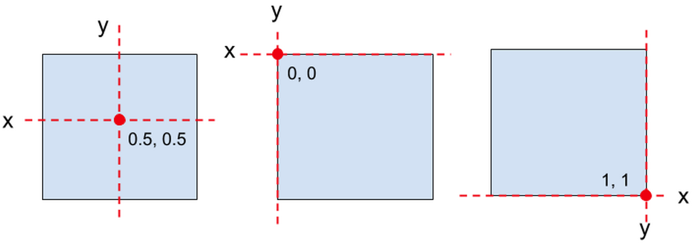

# Trabalhando com texto
O Phaser disponibiliza algumas formas de trabalhar diretamente com textos, que são: texto simples, webfontes e texto bitmap.

## Texto simples
 No modo de texto simples o Phaser utiliza as fontes que normalmente estão disponíveis por padrão do browser tais como: ``Arial, Helvetica, Times New Roman, Times, Courier New, Courier, Verdana, Georgia, Palatino, Garamond, Bookman, Comic Sans MS, Trebuchet MS, Arial Black e
Impact``.

Para criar textos simples no Phaser precisamos instanciar a classe ``Phaser.GameObjects.Text``.
A instanciação é feita com a ajuda do método ``add.text`` disponível na nossa scene. Por exemplo:

```javascript
this.add.text(0, 0, 'Hello World', { fontFamily: 'Arial' });
```
Onde passamos os parâmetros ``(x, y, text, style)``. ``x e y`` é o posicionamento do texto na tela, ``text`` é o texto propriamente dito, ``style`` é um objeto de configuração com os seguintes parâmetros:

``fontFamily, fontSize, fontStyle, backgroundColor, color, stroke, strokeThickness, shadow, padding, align, maxLines, fixedWidth,
fixedHeight, resolution, rtl, testString, baselineX, baselineY,
wordWrap, metrics``

Durante o curso utilizaremos algumas dessas propriedades. Mas se você quiser descobrir o que faz cada uma delas procure por ``Phaser.Types.GameObjects.Text`` na documentação do Phaser.

Para experimentar as formas de trabalhar com texto no Phaser utilizaremos uma pequena estrutura com 2 arquivos: ``index.html`` e ``game.js``. Então crie uma pasta e coloque dentro estes 2 arquivos.

``index.html``
```html
<!DOCTYPE html>
<html lang="en">
  <head>
    <meta charset="UTF-8">
    <title>Text</title>
  </head>
  <body>
    <script src="//cdn.jsdelivr.net/npm/phaser@3.20.0/dist/phaser.js"></script>
    <script src="game1.js"></script>
  </body>
</html>
```
``game1.js``
```javascript
var config = {
  type: Phaser.AUTO,
  scene: {
    create
  }
}
var game = new Phaser.Game(config);

function create() {
  this.texto = this.add.text(400, 300, 'Trabalhando com texto', {
    fontSize: 40,
    fontFamily: "Arial"
  })
  this.texto.setStroke('#aa0000', 4);
  this.texto.setShadow(2, 2, "#333333", 2, true, true);
  this.texto.setOrigin(0.5);
}
```
Como você pode observar, além da criação do texto com ``this.add.text``, temos mais 3 linhas de código que chamam métodos que transformam o texto. O objeto ``Phaser.GameObjects.Text`` possui ainda muitos outros métodos. Para conhecer todos volte a consultar a documentação e faça testes com cada um dos métodos.

Agora vamos fazer uma brincadeira. Crie outro arquivo javascript, por exemplo game2.js, e insira o seguinte código:

```javascript
var config = {
  type: Phaser.AUTO,
  scene: {
    create: create
  },
  backgroundColor: 0xbdbdbd
}

var game = new Phaser.Game(config);

function create() {
  this.counter = 0
  this.texto = this.add.text(400, 300, 'contagem: 0', {
    fontSize: 40,
    fontFamily: "Arial"

  });
  this.texto.setStroke('#aa0000', 4);
  this.texto.setShadow(2, 2, "#333333", 2, true, true);
  this.texto.setOrigin(0.5);


  this.texto.setInteractive();
  this.texto.on('pointerdown', (pointer) => {
    this.texto.text = `contagem: ${this.counter} family: ${fonts[this.counter]}`;
    this.texto.setFontFamily(fonts[this.counter]);
    this.counter++;
  });
}
var fonts = [
"Arial",
"Helvetica",
"Times New Roman",
"Times",
"Courier New",
"Courier",
"Verdana",
"Georgia",
"Palatino",
"Garamond",
"Bookman",
"Comic Sans MS",
"Trebuchet MS",
"Arial Black",
"Impact",
];
```
Agora dê um refresh (CTRL F5) no browser e clique com o mouse no texto.
Não esqueça de alterar o nome o script no arquivo html.
```
<script src="game2.js"></script>
```

Isto é só um exemplo para você começar a perceber o que pode ser feito com o Phaser. Se este código não está claro agora para você, não se preocupe; vamos ver o que significa tudo isso no decorrer do curso.

## setOrigin([x] [,y])

Todos os objetos do Phaser têm um ponto de origem a partir do qual ocorre o posicionamento na tela, a rotação e etc.
Esse ponto de origem de divide em originX, que é a posição de origem em relação ao eixo horizontal, e originY, que é a posição em relação ao eixo vertical.
O valor padrão da origem X e Y é 0.5, isso significa que todos os objetos são posicionados com base no seu centro.
Se definirmos a originX como 0 o ponto de origem horizontal passa a ser o canto esquerdo do objeto, e se o valor for definido para 1 a origem horizontal passa a ser o lado direito do objeto.
No eixo vertical, definido em originY, o valor 0 faz que a origem do objeto passe a ser o topo, enquanto que o valor 1 define a origem para a base inferior do objeto.

Para definirmos o ponto de origem dos objetos chamamos o método ``setOrigin( [x] [, y])``. Podemos tambem chamar esse método passando apenas 1 valor. Nesse caso estaremos definindo originX e originY com o mesmo valor passado.


