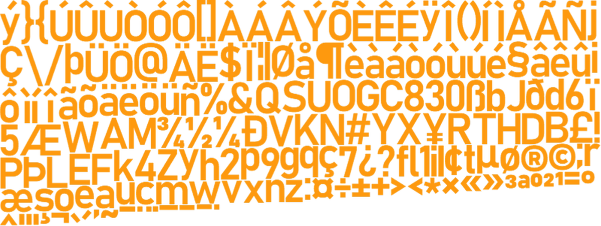
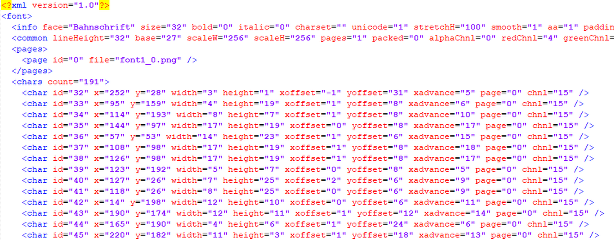

## Bitmap fontes

### Classe Phaser.GameObjects.BitmapText

Um objeto BitmapText é uma instância dessa classe. Na documentação do Phaser você poderá ver todos os métodos e propriedades que podem ser usados para trabalhar com esse objeto.

O objeto BitmapText funciona usando um arquivo de textura  e um arquivo XML ou JSON que mapeia os caracteres dentro da textura. Durante a renderização, cada letra do texto é renderizada na tela, espaçada proporcionalmente e alinhada para corresponder ao mapeamento da fonte.

Os objetos BitmapText são menos flexíveis que os objetos de texto, pois possuem menos recursos, como sombras, preenchimentos e a capacidade de usar fontes da Web; no entanto, você troca essa flexibilidade pela velocidade de renderização. Você também pode criar BitmapTexts visualmente atraentes, processando a textura da fonte em um editor de imagens, aplicando preenchimentos e quaisquer outros efeitos necessários.

Bitmap fonte é uma técnica que utiliza 2 arquivos para escrever os caracteres na tela: um arquivo de imagem e um arquivo de texto com o mapeamento dos caracteres dentro do respectivo arquivo de imagem. O arquivo texto pode estar nos formatos XML, JSON ou CSV. Geralmente para o formato XML, temos um arquivo com a extensão FNT.

Por exemplo:

imagem font.png



arquivo xml font.fnt



Bitmap fontes são muito fáceis de serem utilizadas no Phaser. A classe responsável por essa feature é ``Phaser.GameObjects.BitmapText``.

Para criar uma instância desta classe utilizamos o metódo ``this.add.bitmapText(x, y, font [, text] [, size] [, align])``.

O this representa a scene em que estamos instanciando o objeto. Vamos ao exemplo.

Crie a seguinte estrutura de pasta/arquivo:

```
+ BitmapText
   font.png
   font.fnt
   index.html
   game1.js
```
Você vai encontrar estes arquivos no código fonte do curso.

No arquivo index.html insira o seguinte código:

```html
<!DOCTYPE html>
<html lang="en">
<head>
  <meta charset="UTF-8">
  <title>BitmapText</title>
</head>
<body>
<script src="//cdn.jsdelivr.net/npm/phaser@3.20.0/dist/phaser.js"></script>
<script src="game1.js"></script>

</body>
</html>
```

E no arquivo game1.js:

```javascript
var config = {
  type: Phaser.AUTO,
  scene: {
    preload,
    create
  },
  backgroundColor: 0x000
}
var game = new Phaser.Game(config)
function preload(){
  this.load.bitmapFont('fonte', 'font.png', 'font.fnt');
}
function create() {
  this.counter = 0;
  this.texto = this.add.bitmapText(100, 100, 'fonte', 'Minha Fonte', 32)
}
```
Isto irá imprimir "Minha Fonte" na tela do jogo.

Para alterar o texto do objeto bitmapText criado utilize o método ``this.texto.setText('Outro texto aqui')``

A partir de um arquivo de webfont (ttf) podemos criar nossos arquivos ``font.png`` e ``font.fnt``, usando para isso um aplicativo.

Vamos neste curso apresentar dois aplicativos para essa finalidade: um aplicativo on-line denominado Littera acessível em ``http://kvazars.com/littera``, e o  Bitmap Font Generator que roda na sua máquina e pode ser baixado em ``http://www.angelcode.com/products/bmfont``
