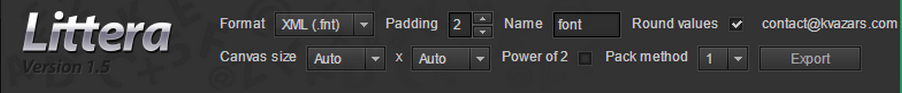
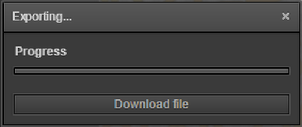

# Littera
Vamos primeiramente aprender como criar bitmap fontes com o Littera.

Passo a passo:

### Abra o Littera no browser
O Littera é um aplicativo feito em Flash. Infelizmente o Google Chrome anunciou que a partir de 2020 o Chrome não dará mais suporte a aplicativos Flash. Mas enquanto isso não acontece vamos aprender como utilizar esse poderoso aplicativo.

Primeiramente acesse o endereço do aplicativo em ``http://kvazars.com/littera``

### A interface do Littera

Visão geral:

Vamos apresentar aqui só os pontos indispensáveis da interface, que lhe permita gerar sua fontes. Mas você deve brincar um pouco com todas as features do aplicativo.

No lado esquerdo do topo, na seção ``Project`` você tem a opção de salvar um projeto de webfonte ou carregá-lo do seu computador.

Logo abaixo dos botões de ``Load project`` e ``Save project`` temos uma caixa de texto para inserirmos algum texto para testar.

Descendo mais ainda, temos a seção Included glyphs que é onde inserimos quais caracteres queremos gerar na nossa webfont. Na caixa de texto podemos digitar os caracteres que queremos ou utilizar alguns dos presets disponíveis. Mas lembre que quanto mais caracteres você utilizar, maior será o arquivo PNG gerado.

Temos também o botão ``Select Font`` que faz o que o nome indica. Nesta seção temos ainda a possibilidade de definir o tamanho da fonte e o espaçamento entre os caracteres. Brinque um pouco com esta seção para descobrir o que pode ser feito.

Na seção de controles no topo do aplicativo temos as configurações de exportação. Você pode deixar tudo como está e utilizar o botão ``Export`` para exportar sua bitmapFont.

Com isso abrirá uma janela com duas caixas de texto. A primeira permite que você coloque várias escalas que deseja exportar como bitmapFont. No exemplo abaixo nós estamos gerando três escalas: 0.5, 1 e 2.

Ao clicar no botão ``Start`` outra janela se abrirá para que você faça download da fonte gerada. O arquivo baixado será um ZIP com os arquivos png e fnt da sua fonte.

