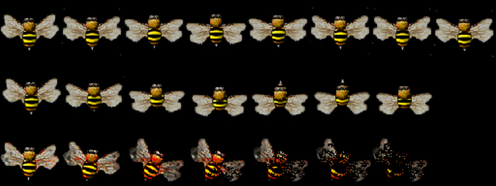
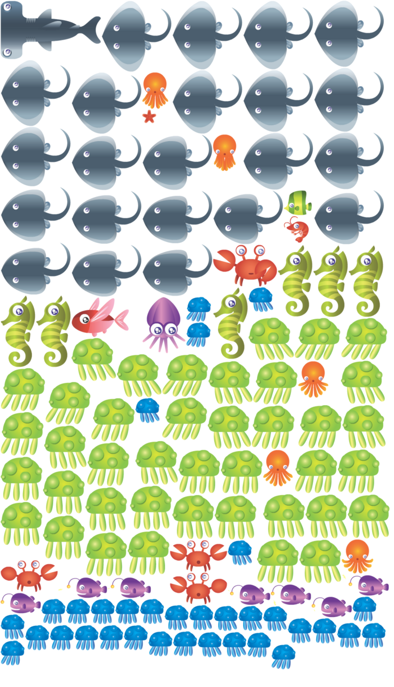

# Animação de sprites

Sprites são instâncias da classe ``Phaser.GameObjects.Sprite``, e são os elementos que podem ser animados na scene. Podemos animar um sprite com base em um spritesheet ou um textureAtlas.

No Phaser as animações são objetos independentes que podem ser atribuídos a qualquer sprite. Isso significa que uma mesma animação pode ser atribuída a diferentes sprites.

Assim como muitos objetos do Phaser, as animações criadas são identificadas por uma ``key`` de identificação, definida na criação da animação.

## Animação com spritesheet

Para criar um sprite animado, usando um spritesheet, temos os seguintes passos.

1. carregar o spritesheet.
2. criar um sprite com uma imagem (textura) qualquer.
3. criar um array com os frames de animação com o método ``generateFramesNumbers``.
4. criar o objeto de configuração da animação
5. criar a animação passando o objeto de configuração
6. executar a animação no sprite criado no passo 2.

A princípio parece algo muito trabalhoso. Na versão 2 do Phaser a configuração de uma animação era mais simples, porém mais limitada. Vamos ver um exemplo primeiramente bem detalhado, e logo em seguida o mesmo exemplo com o código mais enxuto.

Para estes exemplos utilizaremos o seguinte spritesheet:



Exemplo extenso:
```javascript
function preload(){
  this.load.spritesheet('bee', 'bee.png', {
    frameWidth: 64,
    frameHeight: 64
  })
}
function create() {
  this.bee = this.add.sprite(100, 100, 'bee', 0)
  this.frames = this.anims.generateFrameNumbers('bee', {
    start: 0,
    end: 7
  })
  this.config = {
    key: 'voando',
    frames: this.frames,
    frameRate: 40,
    repeat: -1
  }
  this.anims.create(this.config)
  this.bee.anims.play('voando')
}
```
Exemplo enxuto:

```javascript
function preload(){
  this.load.spritesheet('bee', 'bee.png', {
    frameWidth: 64,
    frameHeight: 64
  })
}
function create() {
  this.bee = this.add.sprite(100, 100, 'bee', 0)
  this.anims.create({
    key: 'voando',
    frames: this.anims.generateFrameNumbers('bee', {
      start: 0,
      end: 7
    }),
    frameRate: 40,
    repeat: -1
  })
  this.bee.anims.play('voando')
}
```
Neste segundo exemplo o que fizemos foi chamar o método ``generateFramesNumbers`` dentro do método ``this.anims.create``, e já definimos o objeto de configuração também diretamente dentro do método ``this.anims.create``.

No código fonte você pode explorar estes exemplos.

## Animação com TextureAtlas

O que vai mudar aqui é o tipo de recurso carregado e a substituição do método ``generateFramesNumbers`` por ``generateFramesNames``.

Os passos para animar um sprite usando textureAtlas são:

1. carregar o textureAtlas (a imagem e o json).
2. criar um sprite com uma textura qualquer.
3. criar a animação fazendo uso do método ``generateFrameNames``.
4. adicionar a animação do sprite criado.

Vamos ao exemplo:
```javascript
function preload ()
{
    this.load.atlas('creatures', 'creatures.png', 'creatures.json')
}

function create() {

  this.ray = this.add.sprite(200, 200, 'creatures')
  this.anims.create({
    key: 'stingray',
    frames: this.anims.generateFrameNames('creatures', {
      prefix: 'stingray',
      end: 23,
      zeroPad: 4
    }),
    repeat: -1
  })

  this.ray.play('stingray')
}
  ```
  No textureAtlas o peixe stingray usa frames com o nome stingray0000 até stingray0023.
  O parâmetro zeropad é a quantidade de zero máximo que aparece na numeração dos nomes.

  O textureAtlas é indicado para animações mais complexas enquanto que para animações simples podemos usar facilmente um spritesheet.

  Em seguida temos o textureAtlas utilizado nestes exemplos.

  

  E aqui temos uma pequena parte do arquivo JSON.
  ```json
  {"frames": [

{
	"filename": "blueJellyfish0000",
	"frame": {"x":484,"y":770,"w":64,"h":64},
	"rotated": false,
	"trimmed": true,
	"spriteSourceSize": {"x":0,"y":0,"w":66,"h":66},
	"sourceSize": {"w":66,"h":66}
}
,{
	"filename": "blueJellyfish0001",
	"frame": {"x":484,"y":836,"w":63,"h":65},
	"rotated": false,
	"trimmed": true,
	"spriteSourceSize": {"x":1,"y":0,"w":66,"h":66},
	"sourceSize": {"w":66,"h":66}
}
,{
	"filename": "blueJellyfish0002",
	"frame": {"x":322,"y":1621,"w":62,"h":65},
	"rotated": false,
	"trimmed": true,
	"spriteSourceSize": {"x":2,"y":0,"w":66,"h":66},
	"sourceSize": {"w":66,"h":66}
}
```
