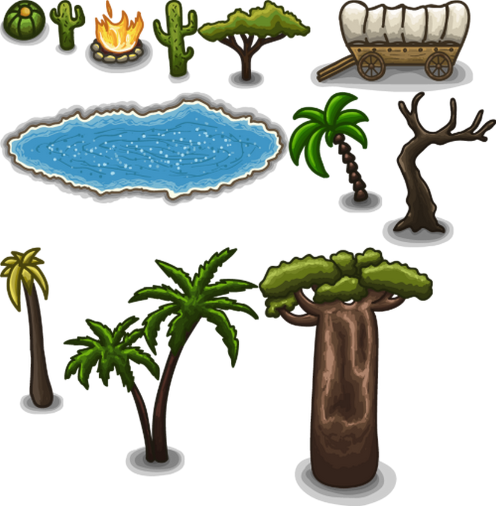

# TextureAtlas e Spritesheet

O termo 'Sprite Sheet' no Phaser significa uma imagem formada por inúmeros frames onde todos eles tem exatamente o mesmo tamanho. Você faz referência a esses frames usando números e não os seus nomes.

Exemplo de sprite sheet:


Já num 'Textura Atlas' os frames são arranjados dentro da imagem de maneira que ocupem o menor espaço possível, e esses frames são referenciados pelos seus nomes com o auxílio de uma arquivo XML ou JSON que contém todos os dados de cada frame.
É bom salientar que alguns artigos e softwares usam o termo 'Sprite Sheet' como sinônimo de 'Texture Atlas'. Então temos que ter cuidado para não confundir as coisas quando trabalhamos com o Phaser.

Exemplo de texture atlas:




Nós podemos criar imagens estáticas ou animações utilizando tanto sprite sheet quanto texture atlas.

Por enquanto vamos ver um exemplo de imagem estática criada com sprite sheet e textura atlas.

```javascript
function preload ()
{
  // sprite sheet
  this.load.spritesheet('bot', 'images/robot.png', { frameWidth: 32, frameHeight: 38 })

  // texture Atlas
  this.load.atlas('mainmenu', 'images/MainMenu.png', 'images/MainMenu.json')
}
```

Exemplos de utilização:

```javascript
function create()
{
  // criando sprites
  this.add.sprite(100, 50, 'bot', 2)
  this.add.sprite(200, 300, 'mainmenu', 'btnStart')

  // criando imagens
  this.add.image(200, 50, 'bot', 2)
  this.add.image(200, 400, 'mainmenu', 'btnStart')
}
```

A princípio não faz diferença se colocamos uma figura na tela com ``sprite`` ou com ``image``. Mas, como já dissemos antes, se queremos uma animação temos que usar os sprites. Então não utilize sprites para imagens estáticas por motivo de economia de recursos da máquina.

Vamos agora criar uma scene com alguns objetos ``sprite`` e ``image``:

```javascript
var lslslsls

```
