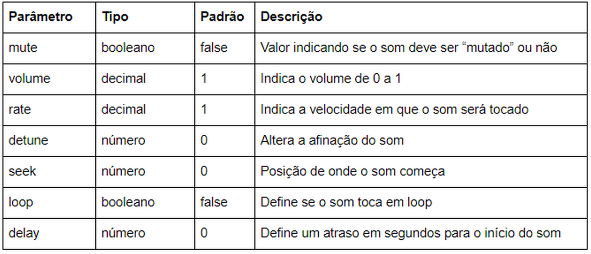
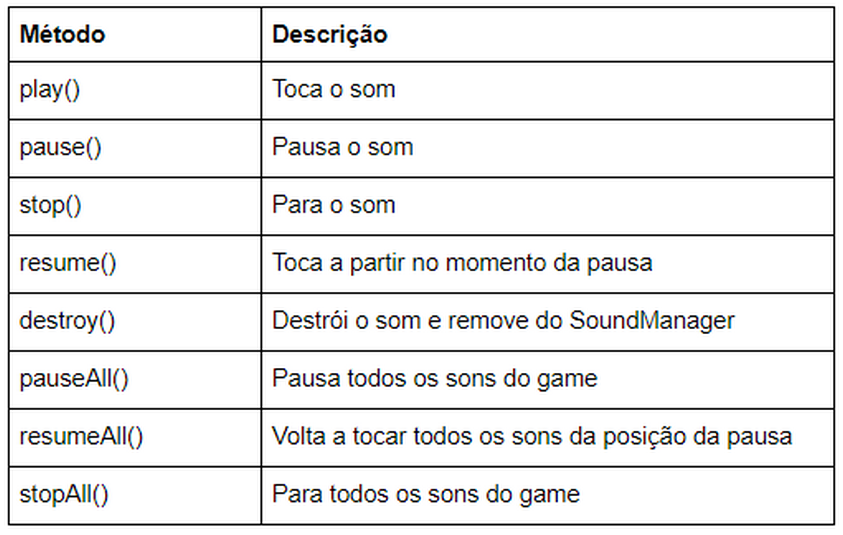

# Sons
Tocar um som no Phaser é uma tarefa bem simples. Basicamente precisamos primeiro carregar o som no preloader e depois utilizá-lo no jogo criando uma instância da classe ``Phaser.Sound.BaseSound`` através do método ``this.sound.add(key [, config])``, onde this é uma referência à scene em que estamos trabalhando. ``key`` é o nome do som carregado no preload, e config é um objeto de configuração opcional, mas que é muito útil; por isso vamos ver mais detalhadamente os parâmetros desse objeto:



Observação: O Chrome não permite o autoplay na página. Isso significa que os sons nesse browser só serão ouvidos quando o usuário clicar ou fizer qualquer ação na página. Isto não é um bug, mas uma política de privacidade do Chrome.

O método ``this.sound.add`` retorna uma instância de ``Phaser.Sound.BaseSound`` que disponibiliza, entre outros, os seguintes métodos:



A seguir temos o código para carregar e tocar um som:

```javascript
var config = {
  type: Phaser.AUTO,
  width: 300,
  height: 300,
  scene: {
    preload: preload,
    create: create
  }
}
var game = new Phaser.Game(config)
function preload() {
  this.load.audio('trilha', ['trilinha.mp3', 'trilinha.ogg'])
}
function create() {
  this.music = this.sound.play('trilha', { loop: true})
  this.music.play()
}
```
(lembre-se de que para o som começar a tocar no Chrome você precisa clicar na tela do browser)

No site <https://opengameart.org> você encontrará muitas trilhas e efeitos sonoros livres para uso.
