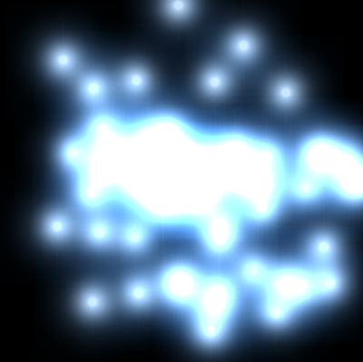
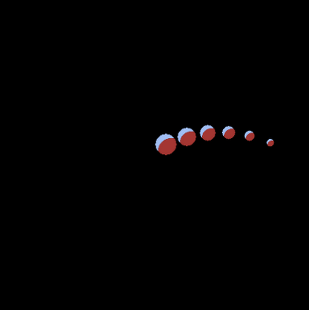

# Partículas

O Phaser tem um poderoso sistema de partículas que compreende desde emissões mais simples até bem complexas.

Para emitir de forma simples partículas temos os seguintes passos.

1. carregar a imagem base no método preload().
2. criar um gerenciador de partículas.
3. criar um emissor (emitter) a partir do gerenciador criado no passo anterior.
4. configurar os atributos do emissor

Exemplo:

```javascript
var config = {
    type: Phaser.WEBGL,
    width: 400,
    height: 400,
    backgroundColor: '#000',
    scene: {
        preload: preload,
        create: create
    }
}
var game = new Phaser.Game(config);
function preload ()
{
  this.load.image('spark', 'blue.png')
}
function create ()
{
  this.particles = this.add.particles('spark')
  this.emitter = this.particles.createEmitter()

    this.emitter.setPosition(200, 200);
    this.emitter.setSpeed(200);
    this.emitter.setBlendMode(Phaser.BlendModes.ADD);
}
```
O resultado será o seguinte:



O método ``this.particles.createEmitter`` retorna uma instância de ``Phaser.GameObjects.Particles.ParticleEmitterManager`` que possui muitos métodos de configuração para a emissão das partículas. No decorrer no curso vamos trabalhar com alguns desses métodos. Pesquise na documentação do Phaser por ``Phaser.GameObjects.Particles.ParticleEmitterManager`` para ter acesso à lista completa de métodos de configuração.

Vamos ver alguns desses métodos?

#### emitParticle( [count] [, x] [, y])
Emite Partículas em uma dada posição, ou na posição atual do emitter.
``x`` e ``y`` definem a posição na tela, enquanto que ``count`` define a quantidade de partículas emitidas.

#### explode(count, x, y)
Coloca o emissor no modo de explosão (frequency = -1), interrompendo qualquer fluxo de partículas atual e emitindo todas as partículas (count) de uma vez.

#### flow(frequency [, count])
Coloca o emissor no modo de fluxo (frequency >= 0) e inicia (ou reinicia) um fluxo de partículas.

#### forEachAlive(callback, context)
Chama uma função callback para cada partícula ativa neste emissor.

#### forEachDead(callback, context)
Chama uma função callback para cada partícula inativa neste emissor.

#### getAliveParticleCount()
Retorna o número de partículas ativas (em uso) do emissor.

#### getDeadParticleCount()
Retorna o número de partículas inativas (disponíveis) do emissor.

#### getParticleCount()
Retorna o número total de partículas do emissor.

#### killAll()
Desativa todas as partículas do emissor.

#### onParticleDeath(callback [, context])
Define uma função callback a ser chamada para cada partícula 'morta'.

#### onParticleEmit(callback [, context])
Define uma função callback para cada nova partícula emitida.

#### setAngle( [degrees])
Define o ângulo da direção da emissão.

#### pause()
Pausa a emissão.

#### resume()
Volta a emitir.

#### stop()
Para a emissão.

#### start()
Se o emissor estiver em modo de fluxo (frequency >= 0), o fluxo de partículas ira iniciar. E se estiver em modo de explosão, nada acontecerá.

Vamos fazer um outro exemplo mais complexo, utilizando um objeto de configuração para o emissor de partículas.

```javascript
var config = {
  type: Phaser.WEBGL,
  width: 400,
  height: 400,
  backgroundColor: '#000',
  scene: {
    preload: preload,
    create: create
  }
}
var game = new Phaser.Game(config)
function preload() {
  this.load.image('gude', 'gude.png')
}
function create() {
  this.particles = this.add.particles('gude')
  this.particles.createEmitter({
    x: 200,
    y: 200,
    lifespan: 2000,
    frequency: 300,
    speed: {
      min: 100,
      max: 100
    },
    angle: 330,
    gravityY: 50,
    scale: {
      start: 1,
      end: 0.2
    }
  })
}
```
O resultado será algo como:



Como já dissemos existem ainda muitos outros métodos para controlar a emissão das partículas, como por exemplo controlar a gravidade, a direção, o ângulo e etc. Veja a documentação do Phaser para descobrir mais. Não esqueça também de estudar os exemplos que estão disponíveis no site do Phaser.

Um dos exemplos bem interessantes no site é o editor de configuração de partículas, que gera automaticamente um ``json`` de configuração do emitter. <http://phaser.io/examples/v3/view/game-objects/particle-emitter/particle-editor>
