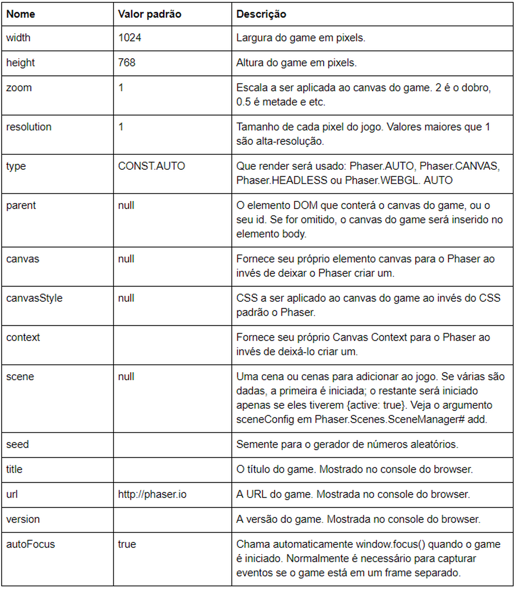
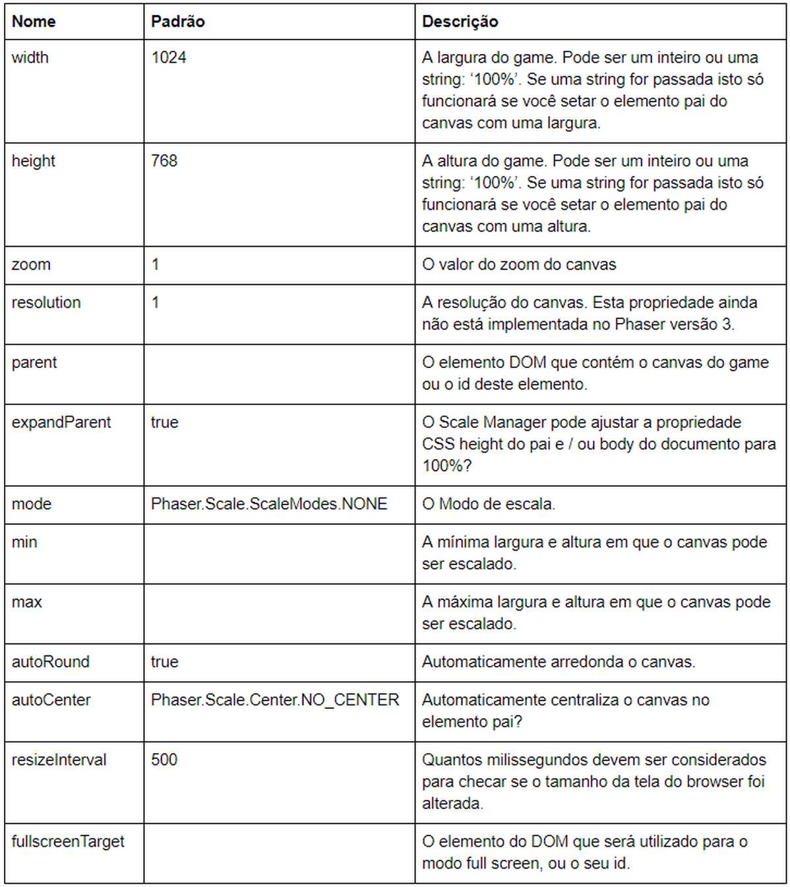
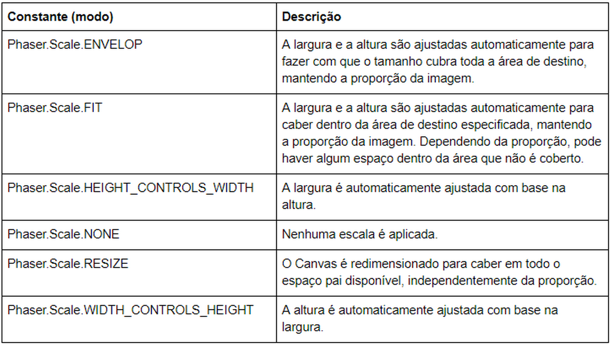

# Configuração do Phaser

Até agora já criamos muitos exemplos com o Phaser, e em todos eles formatamos um objeto de configuração que é passado na criação do objeto da classe ``Phaser.Game``. Neste capítulo vamos estudar mais a fundo este objeto de configuração.

Aqui está a relação completa das propriedades que um objeto de configuração do Phaser pode ter:

A maioria das propriedades desse objeto de configuração são auto-descritivas, mas você pode consultar a documentação do Phaser para saber mais.

Agora vamos estudar mas detalhadamente a propriedade ``scale``.

O objeto de configuração dessa propriedade tem o seguinte conteúdo:

Neste último objeto temos a propriedade ``mode`` que define diretamente o modo como o game será escalonado. Vejamos os valores possíveis:

Veremos na prática algumas dessas configurações quando desenvolvermos os jogos do curso.
