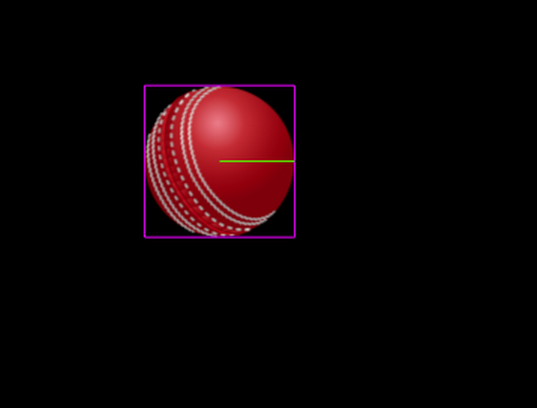
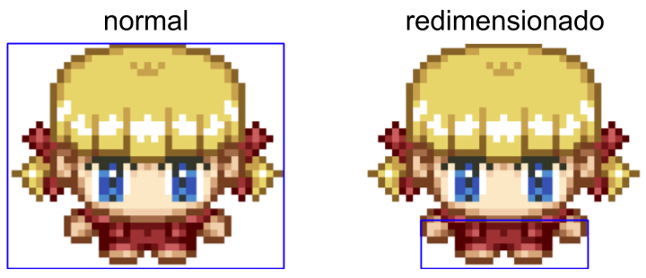

# Física no Phaser

O Phaser suporta 3 sistemas de física: Arcade, Impact e Matter.

O Arcade é um sistema de física bem leve o que o torna perfeito para economizar os recursos do dispositivo mas que ao mesmo tempo permite fazer muita coisa com uma física mais simples.

O Impact é um sistema de física mais avançado que permite trabalharmos com física em tilemaps.

Já o Matter é um sistema de física muito completo com muitas funcionalidades avançadas tais como molas, constraints e sistema avançado de física em polígonos.

No escopo deste curso vamos trabalhar apenas com o sistema Arcade por ser o mais simples e atender perfeitamente a todo desenvolvimento que faremos. Mas, como sempre, no site do Phaser você vai encontrar centenas de exemplos de como trabalhar com o Impact e o Matter.

## Habilitando a física

Para habilitar um sistema de física no Phaser precisamos adicioná-lo no objeto de configuração, como no exemplo seguinte:

```javascript
var config = {
  width: 800,
  height: 600,
  physics: {
    default: 'arcade',
    arcade: {
      gravity: {
        y: 100
      },
      debug: true
    }
  },
  scene: {
    preload: preload,
    create: create
  }
}
```

Na linha 5 definimos o sistema de física padrão para utilizar o Arcade (O Phaser permite utilizar mais de um sistema de física ao mesmo tempo).
Nas linhas 7 e 8 definimos um valor para a gravidade do eixo Y.
Na linha 10 acionamos o debug da física, que serve para mostrar na tela os contornos dos corpos físicos dos objetos.

## Movimento

A primeira coisa que podemos fazer usando a física é mover objetos atribuindo uma velocidade nos seus eixos X e Y. O sentido do movimento em relação às velocidades aplicadas nos eixos são:

| velocidade | deslocamento |
| ---------- | ------------ |
|  X < 0 | esquerda |
| X = 0 | sem movimento horizontal |
| X > 0 | direita |
| Y < 0 | para cima |
| Y = 0 | sem movimento vertical |
| Y > 0 | para baixo |

No próximo exemplo iremos controlar o movimento de uma imagem aplicando uma velocidade aos eixos X e Y dependendo da seta do teclado pressionada. Vamos lá?

O nosso index.html vai ser o de sempre...

```html
<!DOCTYPE html>
<html lang="en">
<head>
  <meta charset="UTF-8">
  <meta name="viewport" content="width=device-width, initial-scale=1.0">
  <title>Phaser</title>
</head>
<body>
  <script src="//cdn.jsdelivr.net/npm/phaser@3.20.0/dist/phaser.js"></script>
  <script src="game1.js"></script>
</body>
</html>
```

Agora o game1.js

```javascript
var config = {
  physics: {
    default: 'arcade',
    arcade: {
      debug: true
    }
  },
  scene: {
    preload: preload,
    create: create,
    update: update
  }
}
var game = new Phaser.Game(config)
function preload() {
  this.load.image('ball', 'ball.png')
  this.load.image('block', 'block.png')
}
function create() {
  this.bola = this.physics.add.image(100, 100, 'ball')
  this.cursors = this.input.keyboard.createCursorKeys()
}
function update() {
  this.bola.setVelocity(0)
  if (this.cursors.left.isDown) {
    this.bola.setVelocityX(-100)
  } else if (this.cursors.right.isDown) {
    this.bola.setVelocityX(100)
  }
  if (this.cursors.up.isDown) {
    this.bola.setVelocityY(-100)
  } else if (this.cursors.down.isDown) {
    this.bola.setVelocityY(100)
  }
}
```

Agora podemos movimentar a bola acionando as setas do teclado. O resultado visual é...



A caixa vermelha em volta da bola é o corpo da física, e o traço verde indica a direção da velocidade. Isto está aparecendo porque nós habilitamos o debug da física no objeto de configuração do Phaser.

Vamos analisar o código em game1.js:

Na linha 19 nós criamos uma imagem com um corpo físico com o método ``this.physics.add.image``. A imagem criada dessa forma tem as mesmas funcionalidades que uma imagem comum, mas a diferença é que agora ela tem um corpo físico que pode interagir com outros corpos e com o 'mundo' físico.

Na linha 20 nós criamos o objeto cursors para podermos ler o acionamentos das setas do teclado.

Na linha 23, no método ``update()``, primeiramente zeramos as velocidades vertical (Y) e horizontal (X) da bola.
Na linha 25 definimos a velocidade X como -100, caso a seta esquerda esteja acionada.
Na linha 27 definimos a velocidade X como 100 positivo, caso a seta direita esteja acionada.
Nas próximas linhas fazemos o mesmo para a velocidade no eixo Y.

## Detecção de colisões

### Colisão entre objeto e mundo

O sistema Arcade tem a funcionalidade de detecção de colisões entre objetos e mundo, entre objetos e objetos, entre objetos e grupos, e entre grupos. Vamos primeiro ver como trabalhar com colisão de objetos com o mundo físico.

Para um objeto colidir com o mundo precisamos chamar o método ``setCollideWorldBounds(true)``. O valor padrão para esse método é true, mas para desabilitar a colisão com o mundo, utilize ``false``.

Vamos então adicionar essa linha no método ``create()``:

```javascript
function create() {
  this.bola = this.physics.add.image(100, 100, 'ball')
  // habilita colisão da bola com o mundo
  this.bola.setCollideWorldBounds()
  this.cursors = this.input.keyboard.createCursorKeys()
}
```

Muito bem. Agora a bola não ultrapassa os limites do mundo.

Vamos acrescentar mais 2 linhas para capturarmos o evento da bola tocar nas bordas do mundo?

```javascript
function create() {
  this.bola = this.physics.add.image(100, 100, 'ball')
  // habilita colisão da bola com o mundo
  this.bola.setCollideWorldBounds()
  // habilita o disparo do evento de colisão da bola com o mundo
  this.bola.body.onWorldBounds = true
  // checa se houve colisão de algum objeto com o mundo
  this.physics.world.on('worldbounds', (body) => console.log(body))
  this.cursors = this.input.keyboard.createCursorKeys()
}
```

### Colisão entre objetos

Agora vamos criar outra bola no método ``create()`` e fazer com que colidam.

```javascript
function create() {
  this.bola = this.physics.add.image(100, 100, 'ball')
  this.bola2 = this.physics.add.image(200, 200, 'ball')
  // habilita colisão da bola com o mundo
  this.bola.setCollideWorldBounds()
  this.bola2.setCollideWorldBounds()
  // habilita o disparo do evento de colisão da cola com o mundo
  this.bola.body.onWorldBounds = true
  this.bola2.body.onWorldBounds = true
  // define que a bola2 vai `recochetear`
  this.bola2.body.setBounce(1, 1)
  // habilita colisão entre as bolas e checa quando colidem
  this.physics.add.collider(this.bola, this.bola2, (a, b) => console.log(`${a} colide com ${b}`))
  this.cursors = this.input.keyboard.createCursorKeys()
}
```

A próxima tarefa é criar um grupo de imagens e fazer com que colida com a bola.

A seguir temos o método ``create()`` atualizado com essa tarefa:

```javascript
function create() {
  // cria bola
  this.bola = this.physics.add.image(100, 100, 'ball')
  // habilita colisão da bola com o mundo
  this.bola.setCollideWorldBounds()
  // cria grupo de física passando um objeto de configuração.
  this.group = this.physics.add.group({
    bounceX: 1,
    bounceY: 1,
    collideWorldBounds: true
  })
  // cria 6 caixas e adiciona ao grupo de física.
  for (let i = 1; i < 7; i++) {
    let block = this.add.image(i * 150, 250, 'block')
    this.group.add(block)
  }
  // habilita colisão entre a bola e o grupo.
  this.physics.add.collider(this.bola, this.group, (a, b) => console.log(`${a} colisão com ${b}`))
  this.cursors = this.input.keyboard.createCursorKeys()
}
```

Se você prestar atenção, vai perceber que a bola colide com as caixas mas as caixas não colidem entre si.
Para habilitar a colisão entre as caixas precisamos habilitar a colisão do grupo com ele mesmo:

```javascript
function create() {
  // cria bola
  this.bola = this.physics.add.image(100, 100, 'ball')
  // habilita colisão da bola com o mundo
  this.bola.setCollideWorldBounds()
  // cria grupo de física passando um objeto de configuração.
  this.group = this.physics.add.group({
    bounceX: 1,
    bounceY: 1,
    collideWorldBounds: true
  })
  // cria 6 caixas e adiciona ao grupo de física.
  for (let i = 1; i < 7; i++) {
    let block = this.add.image(i * 150, 250, 'block')
    this.group.add(block)
  }
  // habilita colisão entre a bola e o grupo.
  this.physics.add.collider(this.bola, this.group, (a, b) => console.log(`${a} colisão com ${b}`))
  this.physics.add.collider(this.group, this.group, (a, b) => console.log(`${a} colisão com ${b}`))
  this.cursors = this.input.keyboard.createCursorKeys()
}
```

### Dimensões do corpo físico.

Por padrão o tamanho (size) do corpo físico é o tamanho da imagem ou objeto, mas as vezes vamos querer ajustar esse tamanho. Por exemplo quando temos uma personagem e queremos que a colisão com os objetos ocorra só na altura dos pés.
Esse redimensionamento é feito com 2 métodos: ``body.setSize(largura, altura)`` e ``body.setOffset(x, y)``. Trabalhando com esse métodos podemos ajudar a posição e o tamanho do corpo físico de qualquer objeto.


