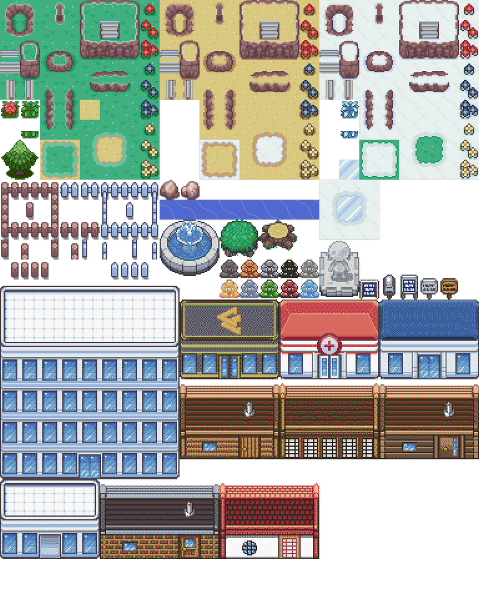
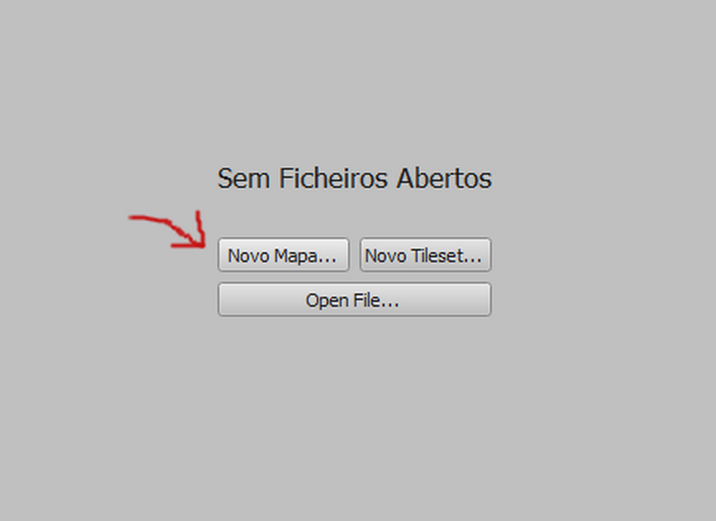
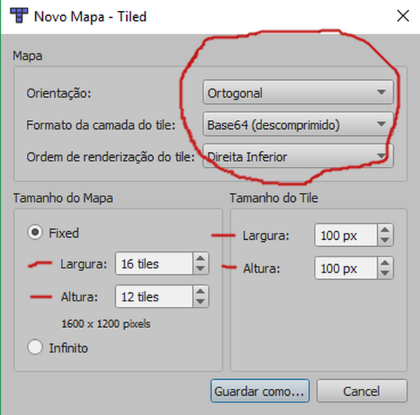
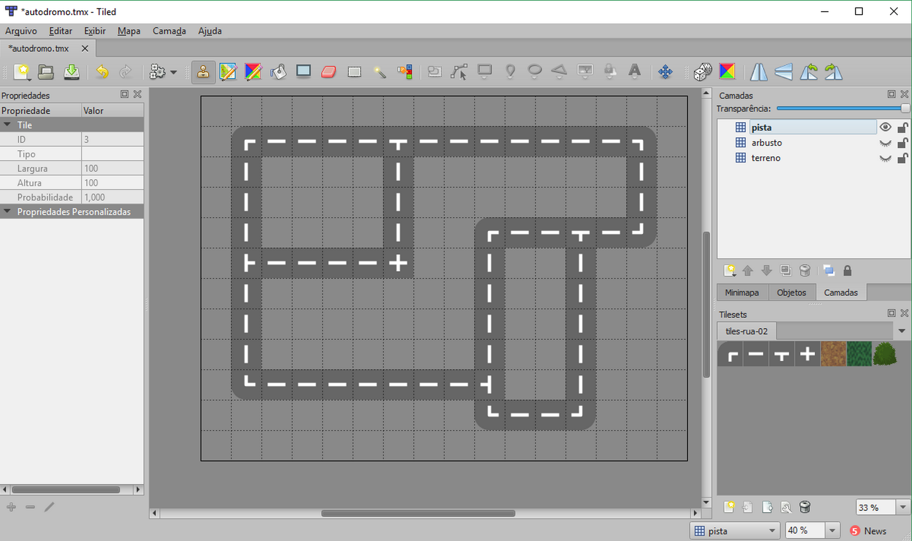
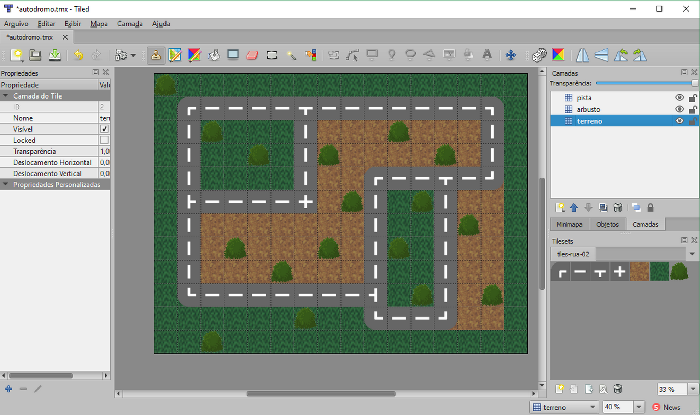
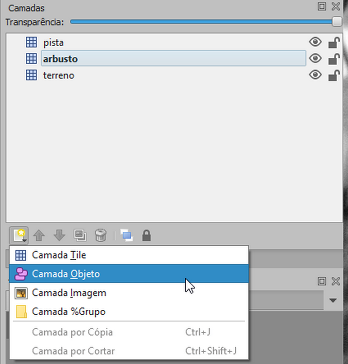
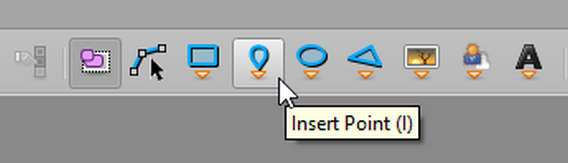
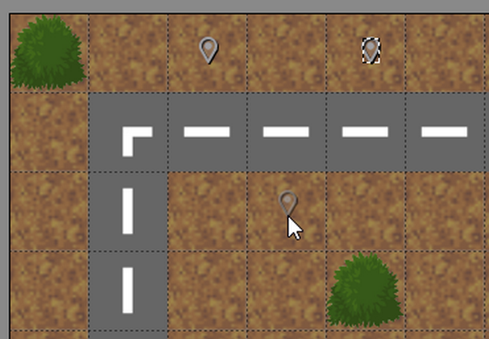
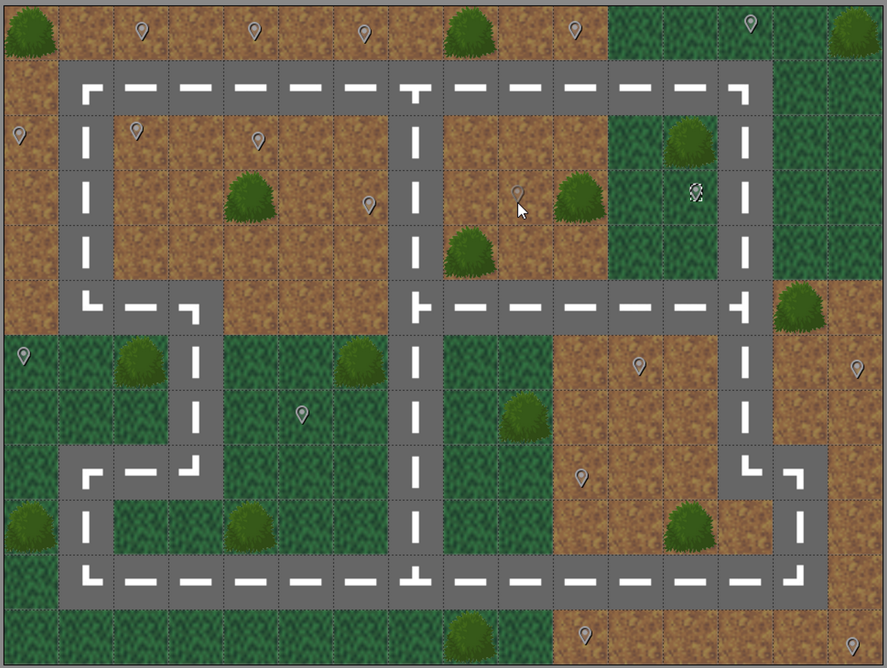

# Tilemap

Tilemap é uma técnica para criar um mundo para jogo a partir de blocos de construção modulares. O objetivo principal é economizar memória, melhorar o desempenho mesmo com um mundo bem grande e, além de tudo é uma forma muito divertida e criativa de criar o mundo para o nosso game.

Cada tile (ladrilho) faz parte de uma imagem maior, o tileset. A seguir temos um exemplo de tileset.



Em seguida temos uma tilemap construido a partir desse tileset.


É importante observar que esta imagem final é construída dentro do Phaser em tempo de execução.

Para montar o tilemap o Phaser precisa de 2 arquivos: uma imagem (geralmente um png com fundo transparente) e um JSON com o mapeamento do tilemap.

## Tiled

Para gerar o mapa JSON a partir de um tileset, utilizaremos um aplicativo open source muito conhecido entre os desenvolvedores de games que é o Tiled, disponível para Windows, Mac e Linux.


A instalação é simples e corrigueira, e está disponível em <https://www.mapeditor.org>

Então, para continuarmos, baixe e instale o Tiled na sua máquina.

## Construção de um autódromo

Como nosso primeiro trabalho com o Tiled vamos construir um autódromo bem simples a partir do seguinte tileset:


O resultado será um tilemap como a figura a seguir. Você não precisa fazer exatamente igual, use a sua criatividade.


Temos aqui um passo a passo para a criação do tilemap, mas você pode também acessar esse mesmo tutorial em vídeo no Youtube em
<https://youtu.be/yh-7Xrnlf2k>.

### Passo a Passo

Abrir o Tiled e criar um novo mapa:



Configurar tamanho do mapa com 16 x 12 tiles.

 

 Salvar como ``autodromo.tmx``.

 

Clicar no botão "Novo Tileset..." e abrir a imagem ``tiles-rua-02.png`` (esta imagem está na pasta ``assets`` no código fonte baixado).


No primeiro parâmetro `Nome:` devemos colocar um nome pelo qual o tileset vai ser identificado no Phaser. No nosso caso vamos deixar como `tiles-rua-02`` mesmo.

Em seguida configurar o tileset: Largura e altura = 100px, Margem e Espaçamento = 0px.


Criar 3 camadas (layers) de tiles: pista, arbusto e terreno (nesta ordem).

[Obs. podemos nos referir a camadas com a nomeclatura na língua inglesa "layers"]


Selecionar a camada pista e desenhar a pista.



Selecionar a camada arbusto e desenhar os arbustos.


Selecionar a camada terreno e desenha o terreno.



Exportar o map como ``autodromo.json`` (este é o JSON que vamos importar no Phaser)


Salvar o Tiled como ``autodromo.tmx``.


Para ver o resultado abra no seu editor de texto o arquivo ``autodromo.json`` que acabamos de criar.

### Usando o Tilemap
Vamos agora aprender como importar o tilemap para dentro do Phaser.

```javascript
var config = {
  width: 800,
  height: 600,
  scene: {
    preload: preload,
    create: create
  }
}
var game = new Phaser.Game(config)
function preload() {
  // carrega o JSON
  this.load.tilemapTiledJSON('map', 'autodromo.json')
  // carrega o tileset
  this.load.image('tiles', 'tiles-rua-02.png')
}
function create() {
  // cria o tilemap
  var map = this.make.tilemap({key: 'map'})
  // cria o tileset onde o primeiro parâmetro é o nome do
  // mapa definido no Tiled.
  var tileset = map.addTilesetImage('tiles-rua-02', 'tiles')
  // cria o layer do terreno
  var terreno = map.createStaticLayer('terreno', tileset, 0, 0)
  // cria o layer do arbusto
  var arbusto = map.createStaticLayer('arbusto', tileset, 0, 0)
  // cria o layer da pista
  var pista = map.createStaticLayer('pista', tileset, 0, 0)
  // reduz escala dos layers para o tamanho da tela
  terreno.setScale(0.5)
  arbusto.setScale(0.5)
  pista.setScale(0.5)
}
```
Na linha 12 carregamos o tilemap.json gerado pelo Tiled.
Na linha 14 carregamos a imagem do tileset.
Na linha 18 criamos o mapa.
Na linha 21 criamos o tileset adicionando a imagem ao mapa. O primeiro parâmetro é o nome do mapa que foi definido no Tiled, e o segundo é o ``key`` da imagem que carregamos na linha 14.
Nas linha 23 a 27 criamos os layers. Observe na ordem em que estão os layers. No Phaser nós podemos configura a profundidade de cada layer, mas nesse exemplo vamos deixá-los já nas devidas profundidades.
Nas linha de 29 a 31 ajustamos a escala dos layers para caber na tela que definimos no objeto de configuração do game.

## Layer de objetos

Podemos ter no tilemap um layer para marcar posição de objetos no mapa. No próximo exemplo iremos criar um layer de objetos no Tiled e exportar novamente o JSON. Então usaremos a camada de objetos do novo mapa para posicionar algumas joias no mundo. Você pode também assistir o vídeo sobre como criar layers de objetos em <https://youtu.be/NgoEUH_FWvA>

Primeiro criamos uma camada de objetos:



Chamamos essa camada de ``joia`` e a arrastamos para o topo das camadas, acima de ``pista``. Para o Phaser, não importa em que nível esteja a camada de objetos, mas para nossa visualização no Tiled, deixamos acima das outras.


Agora na barra de ferramentas selecionamos ``Insert Point``.



Selecionamos a camada de objetos na lista de camadas e já podemos marcar pontos onde ficarão os objetos.



Crie vários pontos de objetos sobre o terreno. Em cada ponto marcado iremos colocar um sprite de moeda no Phaser.

Faça algo do tipo...



Agora exporte novamente o mapa JSON.

### Colocando moedas nas posições de objetos do mapa

Para colocar as moedas no mapa precisamos fazer o seguinte:

1. Carregar o spritesheet da moeda.
2. Criar a animação da moeda girando.
3. Carregar todos os objetos da camada 'joia' num array.
4. Iterar sobre esse array criando uma moeda para cada objeto com os valores x e y tirados do objeto.
5. Dentro do laço ``for`` criar cada moeda e rodar a animação.

A seguir temos o código completo:

``game2.js``

```javascript
var config = {
  width: 800,
  height: 600,
  scene: {
    preload: preload,
    create: create
  }
}
var game = new Phaser.Game(config)
function preload() {
  // carrega o JSON
  this.load.tilemapTiledJSON('map', 'autodromo.json')
  // carrega o tileset
  this.load.image('tiles', 'tiles-rua-02.png')
  //carrega spritesheet das moedas (coins)
  this.load.spritesheet('moedas', 'moedas.png', {
    frameWidth: 16,
    frameHeight: 16
  })
}
function create() {
  // cria o tilemap
  var map = this.make.tilemap({
    key: 'map'
  })
  // cria animação da moeda girando
  this.anims.create({
    key: 'moeda-girando',
    frames: this.anims.generateFrameNumbers('moedas', {
      start: 0,
      end: 7
    }),
    frameRate: 10,
    repeat: -1
  })
  // cria o tileset onde o primeiro parâmetro é o nome do
  // mapa definido no Tiled.
  var tileset = map.addTilesetImage('tiles-rua-02', 'tiles')
  // cria o layer do terreno
  var terreno = map.createStaticLayer('terreno', tileset, 0, 0)
  // cria o layer do arbusto
  var arbusto = map.createStaticLayer('arbusto', tileset, 0, 0)
  // cria o layer da pista
  var pista = map.createStaticLayer('pista', tileset, 0, 0)
  /* cria moedas nos pontos da camada 'joia' */
  // pega array de objetos da camada 'joia'
  var objetos = map.getObjectLayer('joia').objects
  // laço para pegar todos os objetos do array
  for (let i = 0; i < objetos.length; i++) {
    // cria sprite 'moeda' com a posição do objeto
    // os valores de x e y estão divididos por 2 para reduzir a escala
    // conforme estamos fazendo com as camadas
    let moeda = this.add.sprite(objetos[i].x / 2, objetos[i].y / 2, 'moedas')
    // roda animação na moeda
    moeda.anims.play('moeda-girando')
  }
  // reduz escala dos layers para o tamanho da tela
  terreno.setScale(0.5)
  arbusto.setScale(0.5)
  pista.setScale(0.5)
}
```

Na linha 16 carregamos o spritesheet da moeda. Na linha 27 criamos a animação com base no spritesheet. Na linha 47 lemos todos os objetos do layer `joia` para dentro do array ``objetos``. Na linha 49 criamos o laço for para iterar sobre todos os elementos do array. Na linha 53 criamos o sprite da moeda, com a posição x e y do objeto iterado. Na linha 55 adicionamos e rodamos a animação na moeda recém criada.

O resultado será algo como...


## Tiles de colisão

Num mapa de jogo sempre temos elementos de colisão, tais como paredes, chão, objetos e etc. Para fazer isso no Phaser usaremos uma técnica de marcar tiles de colisão no mapa.

A ideia é criar uma propriedade booleana personalizada no tileset (por exemplo "colisao") e marcar alguns tiles específicos com o valor de ``colisão = true``. Feito isso podemos, dentro do Phaser, fazer com que objetos do jogo colidam com esses tiles marcados.

Vamos ao passo a passo:
[Um vídeo tutorial está disponível em <https://youtu.be/jiVNp0V-m5Y>]

Clique no botão ``Editar Tileset``.


Selecione todos os tiles.


Clique no botão ``Adicionar propriedade``.


Crie uma propriedade chamada 'colisao', do tipo ``bool``.


Agora selecione só os tiles de grama e de terra. E marque a propriedade "colisão" como true no checkbox da propriedade.


Salve o arquivo.


 E novamente o ``autodromo.json``.


Agora já temos o nosso mapa com os tiles de colisão devidamente configurados.

Para ver como utilizar os tiles de colisão, vamos criar um game bem simples. Que consistirá em um objeto controlado pelas setas do teclado caminhando pelo autódromo.

``game3.js``

```javascript
var config = {
  width: 800,
  height: 600,
  pixelArt: true,
  physics: {
    default: 'arcade',
    arcade: {
      // desabilita debug da física
      debug: false
    }
  },
  scene: {
    preload: preload,
    create: create,
    update: update
  }
}
var game = new Phaser.Game(config)
function preload() {
  // carrega o JSON
  this.load.tilemapTiledJSON('map', 'autodromo.json')
  // carrega o tileset
  this.load.image('tiles', 'tiles-rua-02.png')
  // carrega o carro
  this.load.image('carro', 'circle.png')
}
function create() {
  // cria o tilemap
  var map = this.make.tilemap({
    key: 'map'
  })
  // cria o tileset onde o primeiro parâmetro é o nome do
  // mapa definido no Tiled.
  var tileset = map.addTilesetImage('tiles-rua-02', 'tiles')
  // cria o layer do terreno
  var terreno = map.createStaticLayer('terreno', tileset, 0, 0)
  // cria o layer do arbusto
  var arbusto = map.createStaticLayer('arbusto', tileset, 0, 0)
  // cria o layer da pista
  var pista = map.createStaticLayer('pista', tileset, 0, 0)
  // cria o carro com imagem pois não precisamos de animação
  this.carro = this.physics.add.image(150, 150, 'carro')
  // habilita tiles de colisão do terreno
  terreno.setCollisionByProperty({
    colisao: true
  })
  // habilita colisão entre o carro e o terreno
  this.physics.add.collider(this.carro, terreno)
  //câmera segue o carro
  this.camera = this.cameras.main
  this.camera.startFollow(this.carro)
  this.camera.setBounds(0, 0, map.widthInPixels, map.heightInPixels)
  // cria o cursos para detectar as setas do teclado
  this.cursors = this.input.keyboard.createCursorKeys()
}
function update() {
  // as próximas linhas definem a velocidade do carro
  // com base nas setas pressionadas no teclado
  this.carro.setVelocity(0)
  if (this.cursors.left.isDown) {
    this.carro.setVelocityX(-200)
  } else if (this.cursors.right.isDown) {
    this.carro.setVelocityX(200)
  }
  if (this.cursors.up.isDown) {
    this.carro.setVelocityY(-200)
  } else if (this.cursors.down.isDown) {
    this.carro.setVelocityY(200)
  }
}
```

Vamos analisar o código:
* Linha 9: desabilitamos o debug da física, para não aparecer as bordas físicas do objeto e nem o indicador da velocidade.
* Linhas de 19 a 25: carregamos o mapa json e as imagens do jogo.
* Linha 29: criação do tilemap.
* Linha 34: criação do tileset.
* Linhas 36 a 40: criação dos layer (camadas).
* Linha 42: criação do carro com um corpo físico.
* Linha 44: habilitamos os tiles de colisão do terreno. Apenas os tiles com a propriedade ``colisao`` marcada como ``true``.
* Linha 48: habilita colisão do carro com o terreno.
* Linhas 50 a 52: Faz a câmera seguir o carro.
* Linha 54: cria o cursos para controlar o carro pelas setas do teclado.
* Linhas 59 a 68: controla o carro com as setas do teclado.

Perceba que agora não estamos alterando a escala das camadas.
O resultado será:


