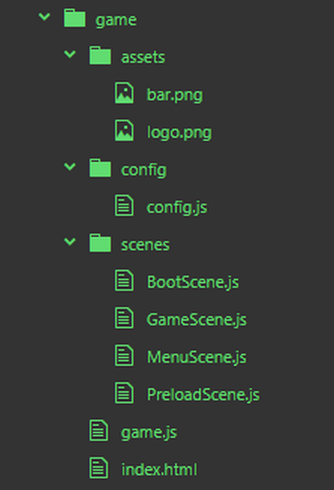

# Cenas (scene)

Um jogo com Phaser se compõe de 1 ou mais scenes. Num jogo completo queremos ter pelo menos 4 scenes: BootScene, PreloaderScene, MenuScene, GameScene, mas você pode ter menos ou mais de acordo como você estruturar o seu jogo. Os nomes das scenes também são livres. Podemos, por exemplo, querer uma scene de créditos.

Na primeira scene, BootScene, nós instanciamos e iniciamos o Phaser, com a sua configuração, e definir todas as scenes do jogo. Carregamos também o logotipo.
Em PreloaderScene carregamos todos os assets do jogo tais como, tilesets, imagens, sons e etc. Na MenuScene temos o botão para iniciar o jogo. Na GameScene temos o jogo propriamente dito.

No Phaser é muito fácil navegar de uma scene para outra.

No próximo exemplo faremos um game só com as 4 scenes básicas com um mínimo de código, apenas para a navegação entre elas.

Para este exemplo criaremos o arquivo game.js e mais os 4 arquivos referentes às scenes. Criaremos um diretório chamado scenes onde colocaremos as scenes. Os únicos assets a serem carregados serão o logotipo do jogo e uma barra de progresso, que estarão dentro do diretório ``assets``. Além disso criaremos um diretório chamado ``config`` onde colocaremos o arquivo de configuração ``config.js``. Então teremos a seguinte estrutura:



Vamos então estudar esse código?

Começando com o arquivo ``index.html``.

```html
<!DOCTYPE html>
<html lang="en">
  <head>
    <meta charset="UTF-8">
    <title>Phaser</title>
  </head>
  <body>
    <script src="//cdn.jsdelivr.net/npm/phaser@3.20.0/dist/phaser.js"></script>
    <script src="game.js" type="module"></script>
  </body>
</html>
```

Na linha 9 temos o parâmetro ``type="module"``. Com esse parâmetro estamos dizendo ao browser que estamos trabalhando modularmente com o Javascript.
Dessa forma podemos importar os trechos de código como módulos a partir do arquivo ``game.js``.

Arquivo ``game.js``.

```javascript
// importa o objeto de configuração e todas as scenes
import phaser_config from './config/config.js'
import GameScene from './scenes/GameScene.js'
import PreloaderScene from './scenes/PreloaderScene.js'
import BootScene from './scenes/BootScene.js'
import MenuScene from './scenes/MenuScene.js'
// cria classe game, estendendo de Phaser.Game
class Game extends Phaser.Game {
  constructor() {
    // é obrigatório chamar o super da classe pai
    // passando o objeto de configuração
    super(phaser_config)
    // registra todas as scene do game
    this.scene.add('Boot', BootScene)
    this.scene.add('Preloader', PreloaderScene)
    this.scene.add('Menu', MenuScene)
    this.scene.add('Game', GameScene)
    // vai para a scene Boot
    this.scene.start('Boot')
  }
}
// instancia Game
const game = new Game()
```

Da linha 2 até a 6 carregamos todos os módulos do game.
Na linha 8 criamos a classe Game, que estende de Phaser.Game. Das linhas 14 a 17 registramos as scenes no game. Na linha 19 chamamos a primeira scene a ser executada. E finalmente, na linha 23 instanciamos a classe Game.

Após esse código ser carregado, ele chamará automaticamente a primeira cena: ``Boot``

Vamos agora analisar o arquivo ``BootScene.js``:

```javascript
export default class BootScene extends Phaser.Scene {
  constructor() {
    super('Boot');
  }
  preload() {
    // carregamento da barra de progresso e do logotipo
    this.load.image('bar', 'assets/bar.png')
    this.load.image('logo', 'assets/logo.png')
  }
  create() {
    // texto
    this.texto = this.add.text(200, 150, 'Boot', {
      fontSize: 40,
      fontFamily: "Arial"
    })
    this.texto.setOrigin(0.5)
    // chama a próxima cena após 3 segundos
    this.time.delayedCall(3000, () => this.scene.start('Preloader'), [], this)
  }
}
```

Na primeira linha criamos a classe BootScene estendendo de Phaser.Scene e exportando como um módulo. Que será carregado pelo arquivo ``game.js``. Nas linhas 7 e 8 carregamos as imagens que utilizaremos em ``PreloaderScene``. Na linha 12 e 13 colocamos na tela um texto com o nome da cena. Na linha 15 programamos uma chamada a uma função callback utilizando o méthodo ``this.time.delayedCall``, que chamará a próxima cena após 3 segundos.

O código mais longo deste exemplo é o que encontramos no arquivo ``PreloaderScene.js``

```javascript
export default class PreloaderScene extends Phaser.Scene {
  constructor() {
    super('Preloader');
  }
  preload() {
    // simula carregamento de 300 assets
    for (let i = 0; i < 300; i++) {
      this.load.image('image' + Phaser.Math.RND.integer(), 'assets/logo.png')
    }
    //progress bar
    this.progressbar = this.add.image(200, 250, 'bar').setOrigin(0.5)
    //percent text
    this.percentText = this.add.text(200, 270, '0 %', {
      fontSize: 16,
      fontFamily: "Arial"
    })
    this.percentText.setOrigin(0.5, 0.5)
    // update progress
    this.load.on('progress', (value) => {
      this.progressbar.setScale(value, 1)
      this.percentText.setText(parseInt(value * 100) + '%')
    })
    // remove progress
    this.load.on('complete', () => {
      this.progressbar.destroy()
      this.percentText.destroy()
      // chama a próxima cena após 1 segundo
      this.time.delayedCall(1000, () => this.scene.start('Menu'), [], this)
    })
  }
}
```

Vamos comentar apenas as linhas principais desse código:

Nas linhas de 7 a 9, simulamos o carregamento de 300 imagens. O método ``Phaser.Math.RND.integer()`` é utilizado aqui para concatenar um número aleatório à ``key`` que será atribuída à imagem. Isso é necessário para que o Phaser não leia o mesmo arquivo em cache. Na linha 11 colocamos a imagem da barra de progresso na tela e setamos sua origem para 0.5.
Na linha 13 criamos o texto para mostrar a porcentagem do carregamento.
Na linha 19 criamos um listener para o evento ``progress`` da cena onde atualizaremos o tamanho da barra de progresso e o texto com a porcentagem.
Na linha 24 criamos outro listener para o evento ``complete`` que destruirá a barra de progresso e o texto, e chamará a scene ``Menu`` após 1 segundo.

Os outros arquivos scenes são semelhantes ao ``BootScene``, não sendo necessário comentar sobre eles.
