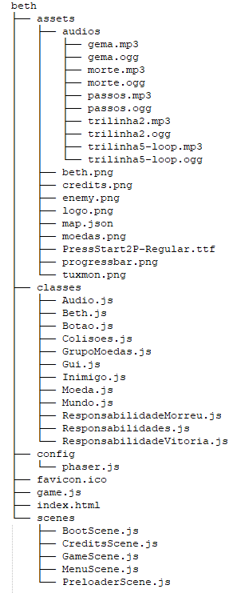
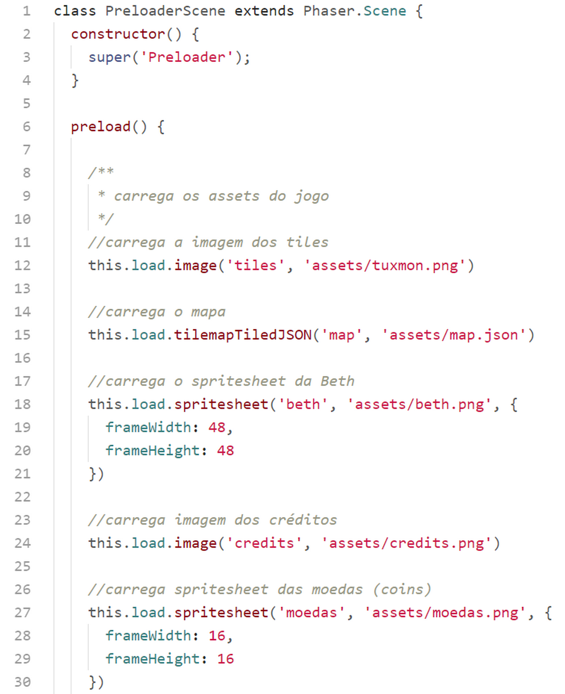
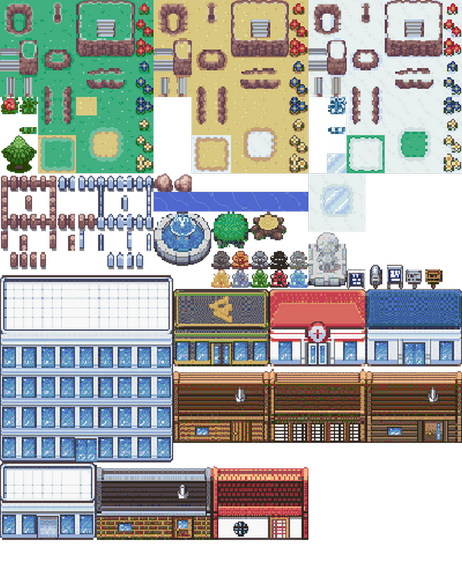
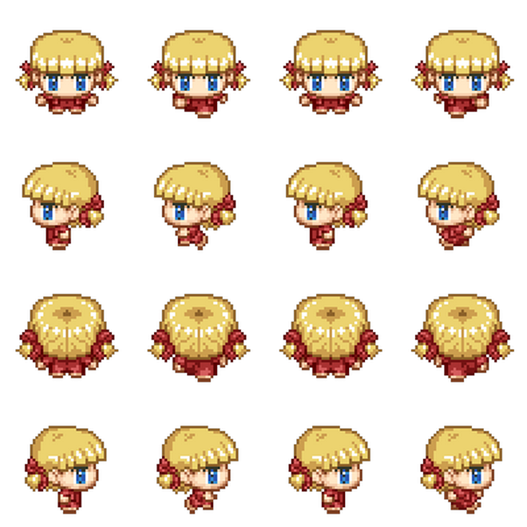

# Beth

O primeiro game que iremos estudar é um jogo topdown (vista de cima) onde nossa personagem precisa coletar as moedas enquanto foge do inimigo. Antes de começar o estudo é importante que você baixe o código do jogo e jogue um pouco para conhecer o que iremos estudar.

Começaremos analisando a estrutura de diretórios e arquivos:

Na primeira pasta ``assets`` temos os áudios, as imagens, os arquivos do tilemap e um arquivo de fonte.

Na pasta ``classes`` temos as classes dos objetos de jogo. Estudaremos individualmente cada uma dessas classes.

Na pasta ``config`` temos um arquivo com o objeto de configuração do Phaser.

Na pasta ``scenes`` estão as 5 cenas que utilizaremos no jogo.

Na parta raiz temos o favicon, o arquivo ``index.html``, o ``game.js`` e o ``phaser.min.js`` (no projeto final é bom carregar a biblioteca direto da estrutura de arquivos em vez de utilizar os CDNs, a não ser que você tenha certeza que o jogo sempre será utilizado em um dispositivo conectado à Internet).

## index.html

Já vimos em exemplos anteriores a estrutura do nosso index.html para carregar o Phaser. Mas vale à pena ressaltar algumas linhas.

Nas linhas 5 e 6 definimos a meta viewport para que nossa página seja responsiva, se adaptando ao tamanho da tela do dispositivo.

Nas linhas de 8 a 17 definimos a margin e padding do body como 0, definimos a cor de fundo como preto, carregamos a webfonte PressStart2P para ser utilizada no game.

Nas linha 18 a 22 estilizamos a classe ``.texto`` para posicionar um elemento ``div`` fora da área visível do dispositivo. Como já vimos em capítulos anteriores, a função dessa ``div`` é carregar a webfonte no documento para garantir que estará disponível para ser utilizada pelo Phaser.

Na linha 28 carregamos a biblioteca do Phaser na sua versão minificada.

Na linha 29 chamamos o arquivo ``game.js`` que é responsável por dar início ao game. Repare que estamos definindo um parâmetro ``type="module"``, para que o browser saiba que iremos trabalhar com módulos no javascript.

## game.js

Este código é responsável por preparar tudo para instanciar o Phaser e iniciá-lo.

Primeiro importamos o objeto de configuração que está definido no arquivo ``./config/phaser.js``. Em seguida, nas linhas de 2 a 6 carregamos as scenes do game.

Nas linhas de 8 a 16 criamos a classe ``Game`` que herda de ``Phaser.Game``. Dentro do bloco de criação da classe passamos o objeto de configuração para a classe pai chamando o método ``super``, e em seguida registramos todas as scenes do game para que possamos chamá-las no momento oportuno.

Na linha 20 instanciamos a classe ``Game`` e iniciamos o game.

Nas linhas de 21 a 24 adicionamos a ``game`` um objeto de dados o qual iremos utilizar em algumas scenes do game.

## scenes/BootScene.js

Essa é a primeira cena a ser chamada, e é nela que carregamos alguns assets mínimos que iremos utilizar na ``PreloaderScene``.

Criamos a classe herdando de Phaser.Scene. No ``constructor`` Passamos para a classe pai o nome da scene pelo método ``super``.

Nas linhas de 6 a 9 carregamos a imagem do logotipo e a barra de progresso.

No método ``create`` definimos valores para o objeto de dados que foi criado em ``game.js``. Observe o caminho para se chegar a esse objeto a partir de uma scene: ``this.sys.game.model``, onde ``this`` faz referência à própria scene.

Na linha 16 passamos o controle para a scene ``Preloader``.

E na linha 20 exportamos o módulo para que possa ser carregado no arquivo ``game.js``.

## scenes/PreloaderScene.js

Nas 3 primeiras linhas declaramos a classe herdando de ``Phaser.Scene`` e passando o nome da scene com o método ``super``. Estas primeiras linhas são semelhantes para todas as scenes criadas.

### método ``preload()``

No método ``preload()`` adicionamos todos os assets do game à fila de carregamento. Nesse método podemos também monitorar esse carregamento sendo possível assim criar barras de progresso e mostrar o carregamento dos assets.

Na linha 12 carregamos a imagem do tileset do tilemap. Lembrando que o primeiro parâmetro é sempre a ``key`` pela qual iremos chamar o assets quando necessário.

Na linha 15 carregamos o ``map.json`` que exportamos do Tiled, atribuindo uma ``key`` "map". Perceba que para criar o tilemap os 2 arquivos, o tileset e o json, são carregados separadamente.

Na linha 17 carregamos o spritesheet da "beth". Nos parâmetros ``frameWidth`` e ``frameHeight`` passamos as dimensões de cada sprite desse spritesheet. É a partir dessas dimensões que o Phaser irá "separar" cada frame do spritesheet.

Na linha 24 caregamos uma imagem que será utilizada na scene dos créditos.

Na linha 27 carregamos outro spritesheet: as moedas.

Na linha 32 carregamos o spritesheet do inimigo.

Nas linhas 39 a 57 carregamos os sons do game. O método ``this.load.audio(key, audio.ogg, audio.mp3) recebe como primeiro argumento a ``key`` pala qual acessaremos o som posteriormente, o segundo parâmetro é o caminho para o arquivo de áudio no formato ``ogg``, e o último parâmetro o caminho para o mesmo som, porém no formato ``mp3``. O fornecimento dos sons nos 2 formatos (ogg e mp3) serve para garantir que o browser poderá tocar o som num formato ou em outro.

Nas linhas 61 a 62 declaramos as constantes width e height com a largura e altura do canvas do game respectivamente.

Na linha 65 colocamos o logo na tela, lembrando que a imagem do logo foi carregada previamente em ``SceneBoot``, assim como a barra de progresso.

Na linha 68 colocamos na tela a barra de progresso utilizando como referência as constantes ``width`` e ``height``.

Na linha 70 definimos o ponto de origem na barra de progresso para o topo do canto esquerdo. Isso é necessário para que o redimensionamento desta barra que será feito durante o carregamento dos assets tenha como origim o início da barra de progresso.

Nas linhas 73 criamos um texto para mostrar a porcentagem do carregamento. Este texto também é posicionado na tela tomando como referência as constantes ``width`` e ``height``. Perceba que estamos utilizando a webfonte "PressStart2P", que foi carregada lá no nosso ``index.html``. Na linha 82 definimos a origem do texto como sendo o centro do mesmo (essa linha é desnecessária já que por padrão o pivô dos objetos é o centro mesmo).

Nas linhas 85 a 93 colocamos na tela outro texto para mostrar o nome do asset que está sendo carregado.

Nas linhas 96 a 98 criamos um evento do tip ``progress`` para "escutar" o carregamento dos assets. A função callback vai atualizar a escala da barra de progresso e a porcentagem de carregamento dos assets.

Nas linha 102 e 103 criamos outro evento, do tipo ``fileprogress``. A função callback vai atualizar o texto com o nome dos assets conforme vão sendo carregados.

E nas linhas de 107 a 110 criamos mais um evento agora do tipo ``complete`` cuja função callback destrói a barra de progresso e os textos de porcentagem e nome do asset.

### Método ``create()``

Depois de carregados todos os assets, o método ``create`` é chamado automaticamente. Dentro deste método definimos um objeto ``time`` do Phaser para chamar a próxima scene depois de meio segundo. Esse delay é puramente "estético", ele evita que, caso os assests sejam carregados muito rápido, a tela de preload passe despercebida.

Finalmente, na linha 120, exportamos a classe para que possa ser importada no arquivo ``game.js``
