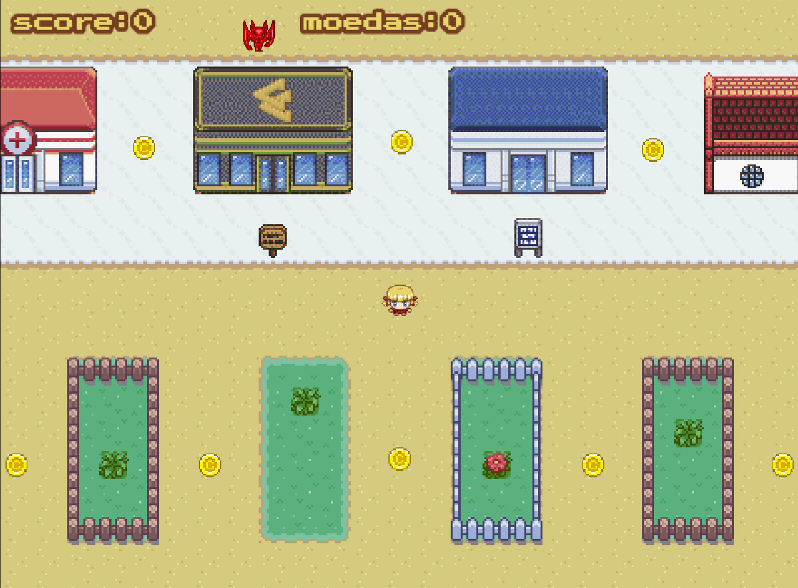
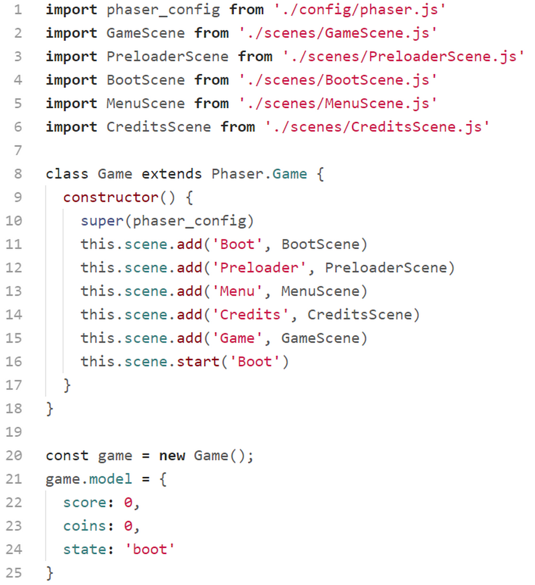

# Beth

O primeiro game que iremos estudar é um jogo topdown (vista de cima) onde nossa personagem precisa coletar as moedas enquanto foge do inimigo. Antes de começar o estudo é importante que você baixe o código do jogo e jogue um pouco para conhecer o que iremos estudar.

Começaremos analisando a estrutura de diretórios e arquivos:

Na primeira pasta ``assets`` temos os áudios, as imagens, os arquivos do tilemap e um arquivo de fonte.

Na pasta ``classes`` temos as classes dos objetos de jogo. Estudaremos individualmente cada uma dessas classes.

Na pasta ``config`` temos um arquivo com o objeto de configuração do Phaser.

Na pasta ``scenes`` estão as 5 cenas que utilizaremos no jogo.

Na parta raiz temos o favicon, o arquivo ``index.html``, o ``game.js`` e o ``phaser.min.js`` (no projeto final é bom carregar a biblioteca direto da estrutura de arquivos em vez de utilizar os CDNs, a não ser que você tenha certeza que o jogo sempre será utilizado em um dispositivo conectado à Internet).

## index.html

Já vimos em exemplos anteriores a estrutura do nosso index.html para carregar o Phaser. Mas vale à pena ressaltar algumas linhas.

Nas linhas 5 e 6 definimos a meta viewport para que nossa página seja responsiva, se adaptando ao tamanho da tela do dispositivo.

Nas linhas de 8 a 17 definimos a margin e padding do body como 0, definimos a cor de fundo como preto, carregamos a webfonte PressStart2P para ser utilizada no game.

Nas linha 18 a 22 estilizamos a classe ``.texto`` para posicionar um elemento ``div`` fora da área visível do dispositivo. Como já vimos em capítulos anteriores, a função dessa ``div`` é carregar a webfonte no documento para garantir que estará disponível para ser utilizada pelo Phaser.

Na linha 28 carregamos a biblioteca do Phaser na sua versão minificada.

Na linha 29 chamamos o arquivo ``game.js`` que é responsável por dar início ao game. Repare que estamos definindo um parâmetro ``type="module"``, para que o browser saiba que iremos trabalhar com módulos no javascript.

## game.js

Este código é responsável por preparar tudo para instanciar o Phaser e iniciá-lo.

Primeiro importamos o objeto de configuração que está definido no arquivo ``./config/phaser.js``. Em seguida, nas linhas de 2 a 6 carregamos as scenes do game.

Nas linhas de 8 a 16 criamos a classe ``Game`` que herda de ``Phaser.Game``. Dentro do bloco de criação da classe passamos o objeto de configuração para a classe pai chamando o método ``super``, e em seguida registramos todas as scenes do game para que possamos chamá-las no momento oportuno.

Na linha 20 instanciamos a classe ``Game`` e iniciamos o game.

Nas linhas de 21 a 24 adicionamos a ``game`` um objeto de dados o qual iremos utilizar em algumas scenes do game.

## scenes/BootScene.js

Essa é a primeira cena a ser chamada, e é nela que carregamos alguns assets mínimos que iremos utilizar na ``PreloaderScene``.

Criamos a classe herdando de Phaser.Scene. No ``constructor`` Passamos para a classe pai o nome da scene pelo método ``super``.

Nas linhas de 6 a 9 carregamos a imagem do logotipo e a barra de progresso.

No método ``create`` definimos valores para o objeto de dados que foi criado em ``game.js``. Observe o caminho para se chegar a esse objeto a partir de uma scene: ``this.sys.game.model``, onde ``this`` faz referência à própria scene.

Na linha 16 passamos o controle para a scene ``Preloader``.

E na linha 20 exportamos o módulo para que possa ser carregado no arquivo ``game.js``.
