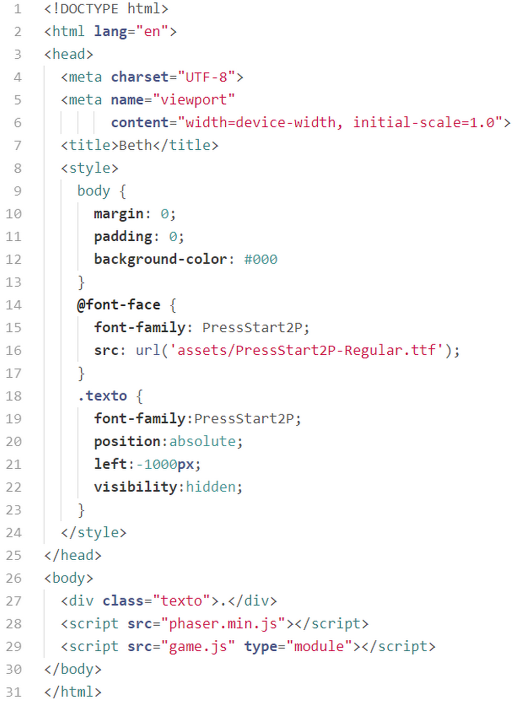

# Beth

O primeiro game que iremos estudar é um jogo topdown (vista de cima) onde nossa personagem precisa coletar as moedas enquanto foge do inimigo. Antes de começar o estudo é importante que você baixe o código do jogo e jogue um pouco para conhecer o que iremos estudar.

Começaremos analisando a estrutura de diretórios e arquivos:

Na primeira pasta ``assets`` temos os áudios, as imagens, os arquivos do tilemap e um arquivo de fonte.

Na pasta ``classes`` temos as classes dos objetos de jogo. Estudaremos individualmente cada uma dessas classes.

Na pasta ``config`` temos um arquivo com o objeto de configuração do Phaser.

Na pasta ``scenes`` estão as 5 cenas que utilizaremos no jogo.

Na parta raiz temos o favicon, o arquivo ``index.html``, o ``game.js`` e o ``phaser.min.js`` (no projeto final é bom carregar a biblioteca direto da estrutura de arquivos em vez de utilizar os CDNs, a não ser que você tenha certeza que o jogo sempre será utilizado em um dispositivo conectado à Internet).

## index.html

