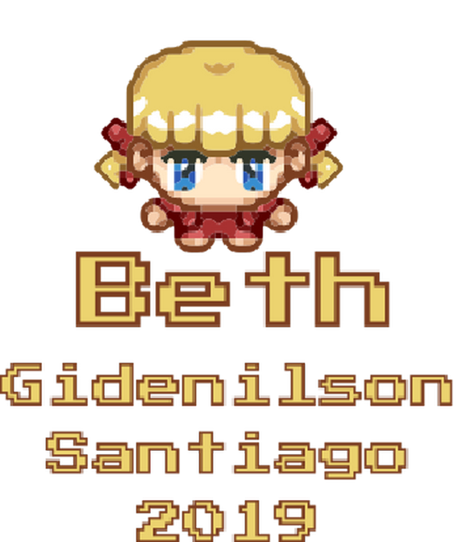
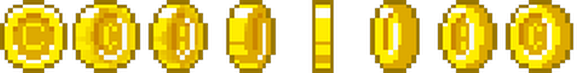
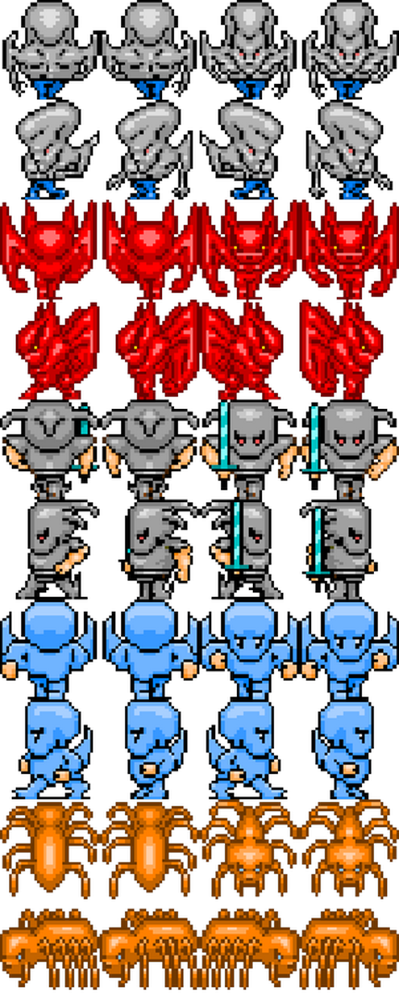
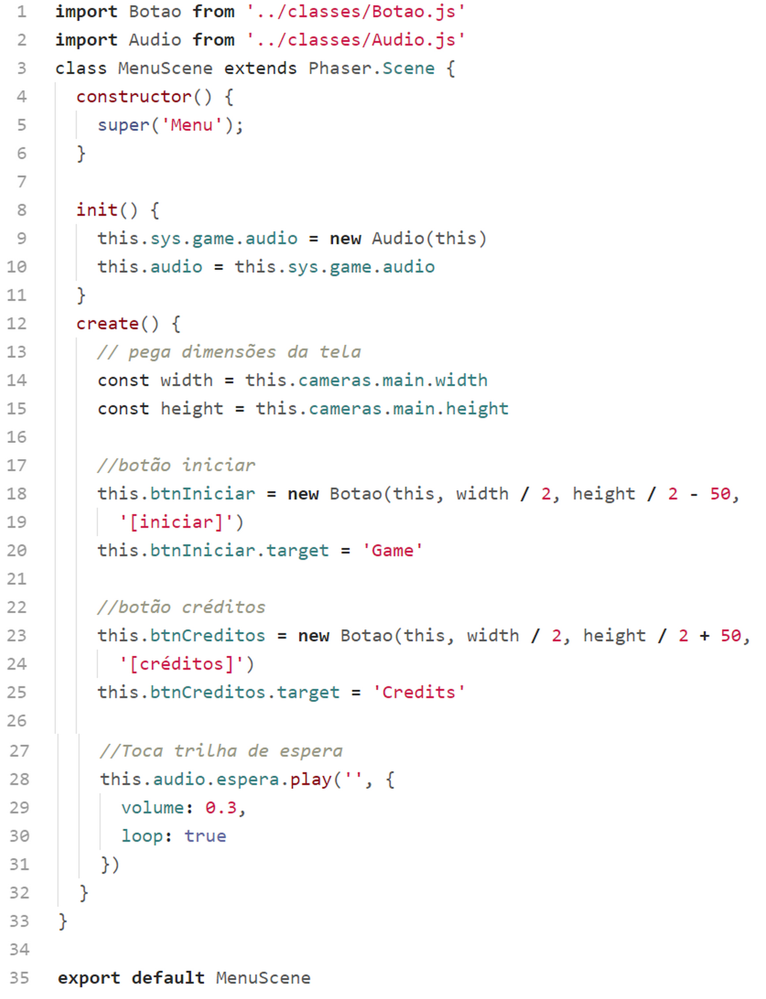
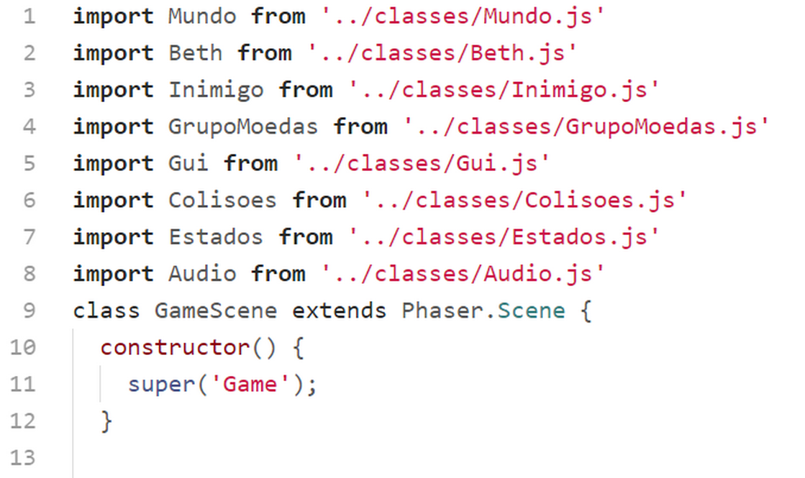
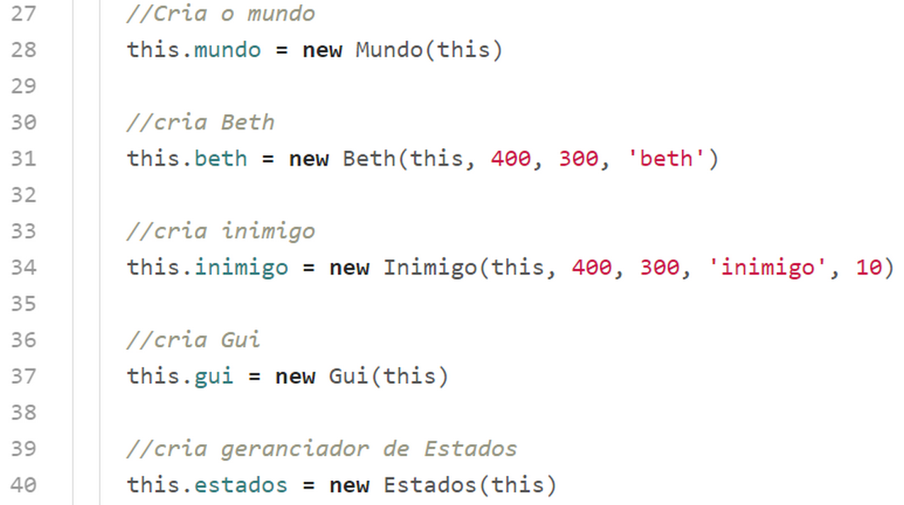
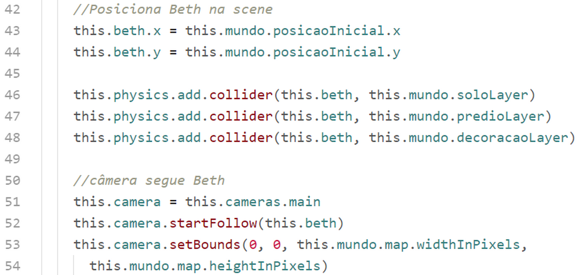
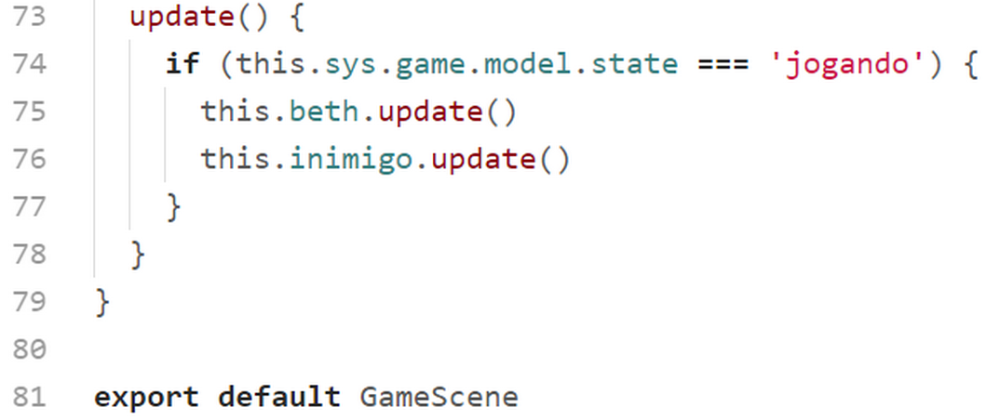
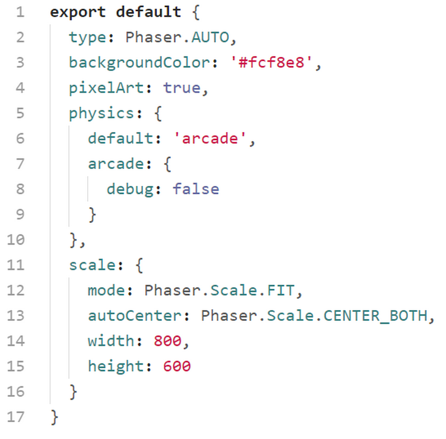

# Beth

O primeiro game que iremos estudar é um jogo topdown (vista de cima) onde nossa personagem precisa coletar as moedas enquanto foge do inimigo. Antes de começar o estudo é importante que você baixe o código do jogo e jogue um pouco para conhecer o que iremos estudar.

Começaremos analisando a estrutura de diretórios e arquivos:

Na primeira pasta ``assets`` temos os áudios, as imagens, os arquivos do tilemap e um arquivo de fonte.

Na pasta ``classes`` temos as classes dos objetos de jogo. Estudaremos individualmente cada uma dessas classes.

Na pasta ``config`` temos um arquivo com o objeto de configuração do Phaser.

Na pasta ``scenes`` estão as 5 cenas que utilizaremos no jogo.

Na parta raiz temos o favicon, o arquivo ``index.html``, o ``game.js`` e o ``phaser.min.js`` (no projeto final é bom carregar a biblioteca direto da estrutura de arquivos em vez de utilizar os CDNs, a não ser que você tenha certeza que o jogo sempre será utilizado em um dispositivo conectado à Internet).

## index.html

Já vimos em exemplos anteriores a estrutura do nosso index.html para carregar o Phaser. Mas vale à pena ressaltar algumas linhas.

Nas linhas 5 e 6 definimos a meta viewport para que nossa página seja responsiva, se adaptando ao tamanho da tela do dispositivo.

Nas linhas de 8 a 17 definimos a margin e padding do body como 0, definimos a cor de fundo como preto, carregamos a webfonte PressStart2P para ser utilizada no game.

Nas linha 18 a 22 estilizamos a classe ``.texto`` para posicionar um elemento ``div`` fora da área visível do dispositivo. Como já vimos em capítulos anteriores, a função dessa ``div`` é carregar a webfonte no documento para garantir que estará disponível para ser utilizada pelo Phaser.

Na linha 28 carregamos a biblioteca do Phaser na sua versão minificada.

Na linha 29 chamamos o arquivo ``game.js`` que é responsável por dar início ao game. Repare que estamos definindo um parâmetro ``type="module"``, para que o browser saiba que iremos trabalhar com módulos no javascript.

## game.js

Este código é responsável por preparar tudo para instanciar o Phaser e iniciá-lo.

Primeiro importamos o objeto de configuração que está definido no arquivo ``./config/phaser.js``. Em seguida, nas linhas de 2 a 6 carregamos as scenes do game.

Nas linhas de 8 a 16 criamos a classe ``Game`` que herda de ``Phaser.Game``. Dentro do bloco de criação da classe passamos o objeto de configuração para a classe pai chamando o método ``super``, e em seguida registramos todas as scenes do game para que possamos chamá-las no momento oportuno.

Na linha 20 instanciamos a classe ``Game`` e iniciamos o game.

Nas linhas de 21 a 24 adicionamos a ``game`` um objeto de dados o qual iremos utilizar em algumas scenes do game.

## scenes/BootScene.js

Essa é a primeira cena a ser chamada, e é nela que carregamos alguns assets mínimos que iremos utilizar na ``PreloaderScene``.

Criamos a classe herdando de Phaser.Scene. No ``constructor`` Passamos para a classe pai o nome da scene pelo método ``super``.

Nas linhas de 6 a 9 carregamos a imagem do logotipo e a barra de progresso.

No método ``create`` definimos valores para o objeto de dados que foi criado em ``game.js``. Observe o caminho para se chegar a esse objeto a partir de uma scene: ``this.sys.game.model``, onde ``this`` faz referência à própria scene.

Na linha 16 passamos o controle para a scene ``Preloader``.

E na linha 20 exportamos o módulo para que possa ser carregado no arquivo ``game.js``.

## scenes/PreloaderScene.js

Nas 3 primeiras linhas declaramos a classe herdando de ``Phaser.Scene`` e passando o nome da scene com o método ``super``. Estas primeiras linhas são semelhantes para todas as scenes criadas.

### método ``preload()``

No método ``preload()`` adicionamos todos os assets do game à fila de carregamento. Nesse método podemos também monitorar esse carregamento sendo possível assim criar barras de progresso e mostrar o carregamento dos assets.

Na linha 12 carregamos a imagem do tileset do tilemap. Lembrando que o primeiro parâmetro é sempre a ``key`` pela qual iremos chamar o assets quando necessário.

Na linha 15 carregamos o ``map.json`` que exportamos do Tiled, atribuindo uma ``key`` "map". Perceba que para criar o tilemap os 2 arquivos, o tileset e o json, são carregados separadamente.

Na linha 17 carregamos o spritesheet da "beth". Nos parâmetros ``frameWidth`` e ``frameHeight`` passamos as dimensões de cada sprite desse spritesheet. É a partir dessas dimensões que o Phaser irá "separar" cada frame do spritesheet.

Na linha 24 caregamos uma imagem que será utilizada na scene dos créditos.

Na linha 27 carregamos outro spritesheet: as moedas.

Na linha 32 carregamos o spritesheet do inimigo.

Nas linhas 39 a 57 carregamos os sons do game. O método ``this.load.audio(key, audio.ogg, audio.mp3) recebe como primeiro argumento a ``key`` pala qual acessaremos o som posteriormente, o segundo parâmetro é o caminho para o arquivo de áudio no formato ``ogg``, e o último parâmetro o caminho para o mesmo som, porém no formato ``mp3``. O fornecimento dos sons nos 2 formatos (ogg e mp3) serve para garantir que o browser poderá tocar o som num formato ou em outro.

Nas linhas 61 a 62 declaramos as constantes width e height com a largura e altura do canvas do game respectivamente.

Na linha 65 colocamos o logo na tela, lembrando que a imagem do logo foi carregada previamente em ``SceneBoot``, assim como a barra de progresso.

Na linha 68 colocamos na tela a barra de progresso utilizando como referência as constantes ``width`` e ``height``.

Na linha 70 definimos o ponto de origem na barra de progresso para o topo do canto esquerdo. Isso é necessário para que o redimensionamento desta barra que será feito durante o carregamento dos assets tenha como origim o início da barra de progresso.

Nas linhas 73 criamos um texto para mostrar a porcentagem do carregamento. Este texto também é posicionado na tela tomando como referência as constantes ``width`` e ``height``. Perceba que estamos utilizando a webfonte "PressStart2P", que foi carregada lá no nosso ``index.html``. Na linha 82 definimos a origem do texto como sendo o centro do mesmo (essa linha é desnecessária já que por padrão o pivô dos objetos é o centro mesmo).

Nas linhas 85 a 93 colocamos na tela outro texto para mostrar o nome do asset que está sendo carregado.

Nas linhas 96 a 98 criamos um evento do tip ``progress`` para "escutar" o carregamento dos assets. A função callback vai atualizar a escala da barra de progresso e a porcentagem de carregamento dos assets.

Nas linha 102 e 103 criamos outro evento, do tipo ``fileprogress``. A função callback vai atualizar o texto com o nome dos assets conforme vão sendo carregados.

E nas linhas de 107 a 110 criamos mais um evento agora do tipo ``complete`` cuja função callback destrói a barra de progresso e os textos de porcentagem e nome do asset.

### Método ``create()``

Depois de carregados todos os assets, o método ``create`` é chamado automaticamente. Dentro deste método definimos um objeto ``time`` do Phaser para chamar a próxima scene depois de meio segundo. Esse delay é puramente "estético", ele evita que, caso os assests sejam carregados muito rápido, a tela de preload passe despercebida.

Finalmente, na linha 120, exportamos a classe para que possa ser importada no arquivo ``game.js``

## scenes/MenuScene.js

Depois de carregar todos os assets paramos nesta scene onde temos 2 botões: ``[iniciar]`` e ``[créditos]``.

Nas 2 primeiras linhas importamos as classes ``Botao`` e ``Audio`` (essas classes serão estudadas posteriormente).

Nas linhas 3 a 4, ``constructor()``, criamos a classe ``MenuScene`` que herda de ``Phaser.Scene``, e passamos o nome da scene chamando o método ``super``.

Nas linhas de 8 a 11 temos o método ``init()`` que por padrão é o primeiro a ser executado automaticamente quando a scene iniciar. Dentro deste método instanciamos a classe ``Audio`` e anexamos ao objeto de dados do jogo (aquele objeto criado no ``game.js``). Criamos também uma variável da scene, ``this.audio`` e colocamos o objeto de áudio criado.

Nas linhas 13 e 14 criamos as constantes ``width`` e ``height`` com as dimensões da tela.

Nas linhas 18 e 19 criamos a variável ``this.btnIniciar`` instanciando a classe ``Botao``, que será vista adiante. Posicionamos o botao na tela tendo como referência as constantes ``width`` e ``height``. Na linha 20 definimos o valor ``Game`` para a propriedade ``target`` do botão criado. Isso fará com que ao ser pressionado o game passe para a scene com o nome ``Game``.

Nas linhas 23 a 25 criamos outro botão, para navegar até a scene ``Credits``.

Nas linhas 28 a 30 tocamos a música de espera com o volume em 30% e em loop.

E por fim, na linha 35 exportamos a classe.

## scenes/CreditsScene.js

Esta scene é nossa tela de créditos, nela colocamos a imagem com os créditos e um botão para acessar o menu. O código dispensa comentários.

## scenes/GameScene.js

Esta é a scene onde o game acontece.

Até a linha 12 carregamos as classes e estendemos a classe Phaser.Scene da mesma forma como nas outras scenes.

### Método ``create()``

Na linha 16 colocamos a string ``jogando`` no objeto de dados do game.

Na linha 19 recuperamos o objeto ``audio`` para gerenciar as músicas nesta scene. Na linha 20 paramos a música de espera, e nas linhas de 21 a 23 tocamos a música do game.

Nas linhas de 28 a 40 instanciamos os objetos do game. Cada um desses objetos está implementado num arquivo separado por questões de organização do código do nosso game. Veremos cada classe mais adiante.

Nas linhas 43 e 44 posicionamos a personagem na posição inicial. Esta posição vem de um objeto específico no JSON do tilemap. Este código ficará claro quando estudarmos a classe ``Mundo``.

Nas linhas 46 a 48 habilitamos as colisões entre a personagem e as camadas (layers) do tilemap.

Nas linhas de 51 a 54 habilitamos a câmera do game a acompanhar a personagem.

Na linha 57 instanciamos a classe ``GrupoMoedas``. O segundo parâmetro deste constructor é um array com os objetos moedas vindos do JSON do tilemap.

Nas linhas 60 a 62 instanciamos o gerenciador de colisões e atribuimos 2 eventos que serão executados quando as moedas acabarem e quando o inimigo pegar a personagem. O callback desses eventos está definido na classe ``Estados`` que estudaremos a seu tempo.

Nas linhas 65 e 66 definimos um callback a ser chamado quando houver sobreposição das moedas com a personagem. O método ``this.colisoes.bethMoedas(b)`` irá tratar esse evento, como veremos adiante.

Nas linhas 69 e 70 fazemos o mesmo para a sobreposição do inimigo e a personagem.

### Método ``update()``

O método ``update()`` é executado a cada frame do game a 60fps (60 frames por segundo). Neste método atualizamos os objetos ``beth`` e ``inimigo`` caso o estado do jogo seja "jogando".

Na linha 81 exportamos a scene.
Podemos perceber que o código da ``SceneGame`` é relativamente pequeno para um jogo. Isso é porque a lógica do game está distribuída nas classes dos objetos do jogo que iremos estudar em seguida. Mas antes vamos olhar rapidamente o código do script ``config/phaser.js``.

## config/phaser.js

Vejamos o significado de cada propriedade deste objeto de configuração:

### type

Phaser.AUTO

Deixa o Phaser escolher automaticamente o modo de renderização.

### backgroundColor
\#fcf8e8

Como o nome sugere é a cor de fundo do canvas do game.

### pixelArt

true

Esta propriedade sendo true define que o Phaser vai deixar o game com aspecto pixelado quando as imagens são renderizadas com escalas aplicadas.

### physics

Aqui configuramos a física do jogo para "arcade", que é um dos motores de física suportados disponíveis no Phaser.

### scale

#### mode: Phaser.Scale.FIT

Define que o canvas do game será redimensionado para o preenchar o tamanho da tela do dispositivo.

#### autoCenter: Phaser.Scale.CENTER_BOTH

Define que o cavas ficará centralizado horizontal e verticalmente.

#### width: 800
Largura do canvas.

#### height: altura do canvas.
