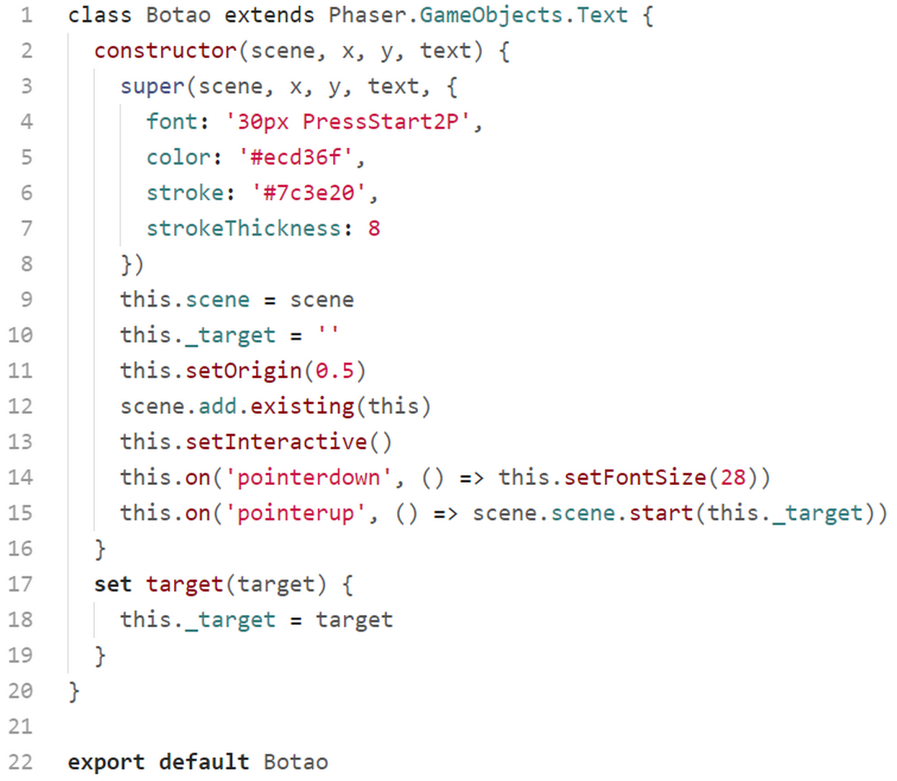

## classes/Audio.js

Nesta classe colocamos todos os objetos de sons do game, para serem chamados no momento oportuno. Lembrando que todos os assets de sons já foram previamente carregados na ``PreloaderScene``.

Esta classe dispensa muito comentários pois creio que a implementação está bastante clara. Veremos mais adiante como executar os sons a partir dessa classe.

## classes/Botao.js

Esta classe é responsável por criar os botões que temos no jogo. São botões de texto que quando clicados chamam uma scene.

Na linha 3 a 7 chamamos a classe pai passando para o método ``super()`` a scene, a posição x e y, e um objeto de configuração do texto.

Na linha 10 definimos uma propriedade "privada" this._target, que irá conter o nome da scene a ser chamada quando o botão for clicado. Nós setamos o valor dessa propriedade chamando o método setter ``target`` definido na linha 17.

Na linha 11 definimos a origem do botão para o centro do mesmo (isso já era padrão e não precisaria ser definido aqui, mas fica como exemplo).

Na linha 12 adicionamos o botão na scene.

Na linha 13 tornamos o botão clicável.

Na linha 14 definimos o evento "pointerdown", que mudará o tamanho da fonte quando pressionarmos o botão.

Na linha 15 definimos o evento "pointerup" que chamará a scene alvo quando soltarmos o botão.

## classes/Colisoes.js

Esta classe não é um objeto de exibição, ela é responsável por gerenciar as colisões entre a personagem e as moedas, e a personagem e o inimigo. O código é bem simples.

