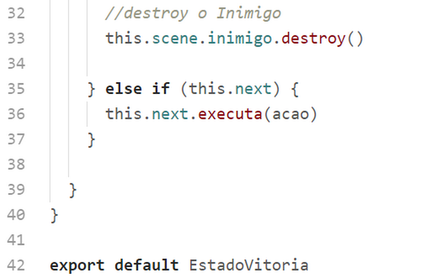
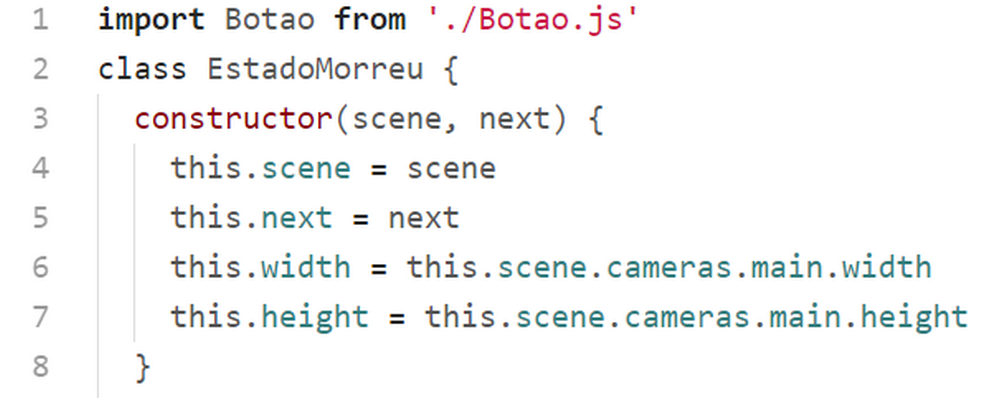
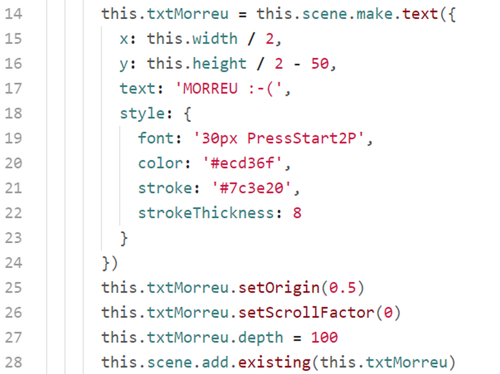
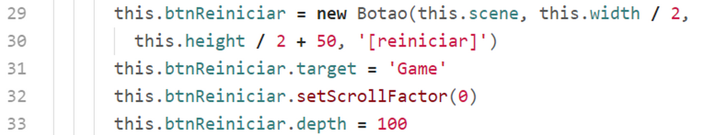
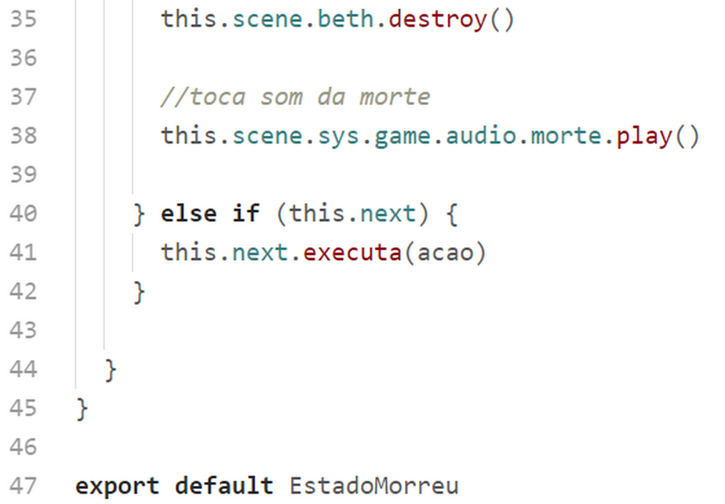

## classes/Audio.js

Nesta classe colocamos todos os objetos de sons do game, para serem chamados no momento oportuno. Lembrando que todos os assets de sons já foram previamente carregados na ``PreloaderScene``.

Esta classe dispensa muito comentários pois creio que a implementação está bastante clara. Veremos mais adiante como executar os sons a partir dessa classe.

## classes/Botao.js

Esta classe é responsável por criar os botões que temos no jogo. São botões de texto que quando clicados chamam uma scene.

Na linha 3 a 7 chamamos a classe pai passando para o método ``super()`` a scene, a posição x e y, e um objeto de configuração do texto.

Na linha 10 definimos uma propriedade "privada" this._target, que irá conter o nome da scene a ser chamada quando o botão for clicado. Nós setamos o valor dessa propriedade chamando o método setter ``target`` definido na linha 17.

Na linha 11 definimos a origem do botão para o centro do mesmo (isso já era padrão e não precisaria ser definido aqui, mas fica como exemplo).

Na linha 12 adicionamos o botão na scene.

Na linha 13 tornamos o botão clicável.

Na linha 14 definimos o evento "pointerdown", que mudará o tamanho da fonte quando pressionarmos o botão.

Na linha 15 definimos o evento "pointerup" que chamará a scene alvo quando soltarmos o botão.

## classes/Colisoes.js

Esta classe não é um objeto de exibição, ela é responsável por tratar as colisões entre a personagem e as moedas, e a personagem e o inimigo.
O código é bem simples. Temos 2 métodos que serão utilizados como callback no evento de colisões que veremos mais adiante.

### Método ``bethMoedas(moeda)``

Na linha 7 destruimos a moeda que colidiu com a personagem. Nas linhas 8 e 9 atualizamos a contagem de pontos e as moedas colhidas no objeto de dados que criamos lá no nosso arquivo ``game.js``.

Na linha 10 atualizamos a exibição de pontos e moedas no objeto da classe ``Gui`` que veremos mais a frente. Este objeto está anexado à scene, por isso podemos acessá-lo com ``this.scene.gui.update()``.

Na linha 11 e 12 testamos se as moedas acabaram e nesse caso emitimos um evento "acabou_moedas" que será escutado na scene ``GameScene``, na linha 61.
Na linha 16 tocamos o som da moeda executando o método ``play()`` do objeto ``audio.moeda`` que foi declarado na classe ``Audio``, como já vimos. Este objeto foi anexado ao game na ``MenuScene``, linhas 9 e 10. Por isso podemos acessá-lo com ``this.scene.sys.game.audio.moeda.play()``.

### Método ``bethInimigo()``

Nas linhas 18 e 19 temos o método ``bethInimigo`` que será usado como callback da colisão entre a personagem e o inimigo. Este método apenas emite o evento "pegou", que será escutado em ``GameScene``, linha 62.

## Chain of responsibility (Responsabilidades.js, ResponsabilidadeMorreu.js, ResponsabilidadeVitoria.js)

Com estas 3 classes montamos o padrão de projetos "chain of responsibility" (corrente de resposabilidades) para lidar com a vitória ou morte da personagem.

Na figura temos um esquema de como as 3 classes interagem.

Na ``GameScene.js`` instanciamos a classe Responsabilidades. Dentro da classe da classe Responsabilidades instanciamos ResponsabilidadeVitoria e responsabilidadsMorreu.

Na classe GameScene chamamos o método this.responsabilidades.executa('vitoria') ou this.responsabilidades.executa('morreu')).

A partir daí a classe Responsabilidades chama o método executa() da classe ResponsabilidadeVitoria que executa a ação "vitória" ou passa a responsabilidade para a classe responsabilidadeMorreu se a ação não é "vitória".

A vantagem de montar esse padrão é que poderíamos ter muitas outras ações e só precisaríamos para isso criar uma classe para cada nova ação, sem precisar mexer nas outras classes.

Vamos agora analisar as 3 classes dessa corrente.

### classes/Responsabilidades.js

Nas linhas nas primeiras 2 linhas importamos as 2 classes auxiliares correspondentes as ações "vitoria" e "morreu".

Na linha 6 colocamos o objeto this.escene.sys.game.audio na variável this.audio (), lembrando que o objeto this.scene.sys.game.audio foi criado na linha 9 em ``SceneMenu.js``.

No método executa(acao) primeiramente paramos a música do jogo e iniciamos tocamos a música de espera.

Na linha 16 instanciamos a classe ResponsabilidadeMorreu, passando como parâmetro this.scene.

Na linha 17 instanciamos a classe ResponsabilidadeVitoria, passando como parâmetro this.scene e a this.morreu.

Na linha 18 chamamos this.vitoria.executa(acao), que dará início à corrente de responsabilidades.

### classes/ResponsabilidadeVitoria.js

Na primeira linha importamos a classe Botao.

Na linha 5 definimos a variável this.next com o a classe que passada no segundo parâmetro do constructor. No nosso caso a classe passada aqui foi responsabilidadeMorreu.

Nas linhas 6 e 7 pegamos as dimensões da tela do game.

Aqui temos definido o método executa(acao).

Na linha 10 verificamos se a ação a ser executada é "vitoria". Se for, tratamos essa ação nas próximas linha. E caso não seja, passamos para a linha 36 que veremos mais a frente.

Na linha 11 definimos o estado do gama para 'vitoria'.

Nas linha 12 a 16 criamos um botão que chamará SceneGame quando pressionado.

Na linha 15 definimos a propriedade this.btnReiniciar.setScrollFactor(0), que fará com que o botão fique fixo na tela independentemente da posição da câmera.

Na linha 16 definimos a profundidade do botão como 100 para garantir que não será sobreposto por outros objetos do game.

Nas linha 17 a 27 criamos um objeto para mostrar o texto "VITÓRIA !!!" na tela.

Nas linhas 29 e 30 definimos o fator de scroll para 0 fixando o texto na tela e definimos a profundidade com 100 para, da mesma forma, garantir que o texto não seja sobreposto por outros objetos.

Na linha 33 destruímos o inimigo.

Se a ação não for "vitoria" todo o bloco anterior não será executado e a linha 36 chama o método executa da próxima classe, que no nosso caso é responsabilidadeMorreu.

### classes/ResponsabilidadeMorreu.js

Na primeira linha importamos a classe Botao.

Na linha 5 definimos a variável this.next com o a classe que passada no segundo parâmetro do constructor. No nosso caso a classe passada aqui foi responsabilidadeMorreu.

Nas linhas 6 e 7 pegamos as dimensões da tela do game.

Na linha 10 verificamos se a ação é "morreu". Se for, executaremos o bloco de código a partir da linha 11.

Nas linhas 11 a 13 definimos as variáveis de dados do game.

Nas linhas de 14 a 28 colocamos na tela o texto "MORREU :-(", com o fator de scroll 0 e profundidade 100 como nos textos anteriores.

Nas linhas 29 a 33 colocamos o botão "[reiniciar]"  na tela.

Na linha 35 destruímos a personagem e na linha 38 tocamos o som da morte.

A linha 40 passaríamos a execução para a classe seguinte se a ação não fosse "morreu". No nosso caso isso não ocorrerá porque esta classe é a última da corrente de responsabilidade.
