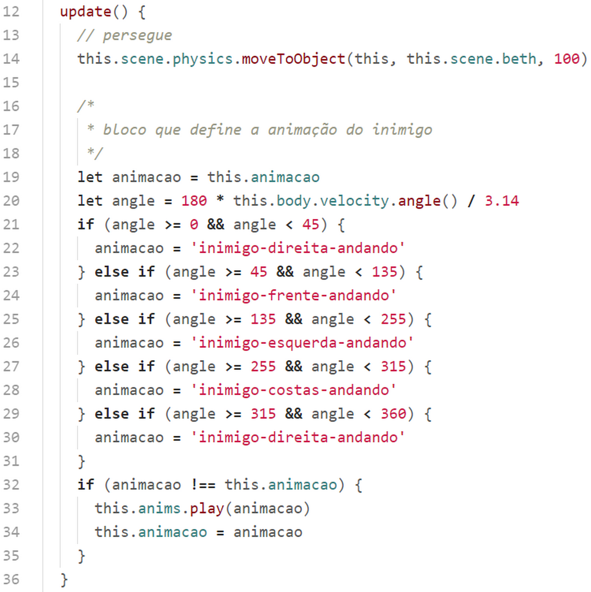
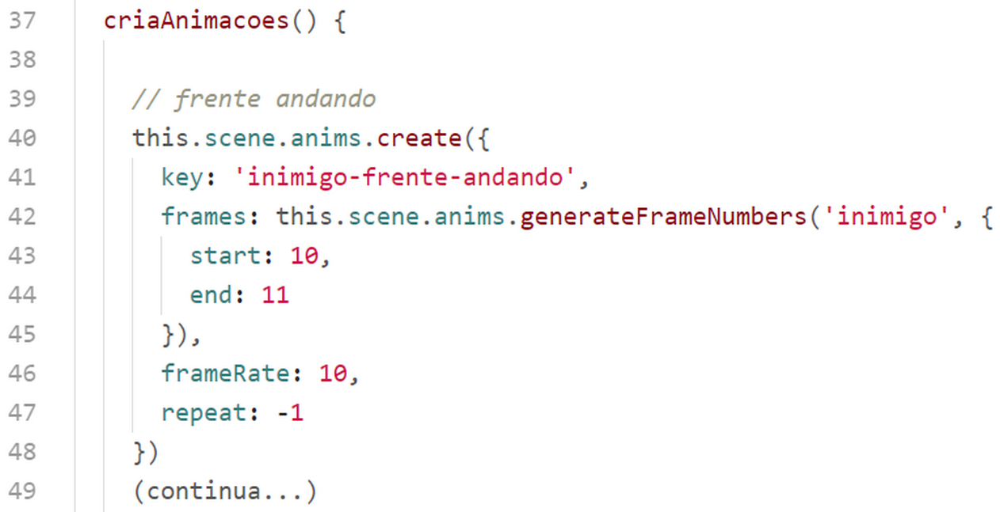
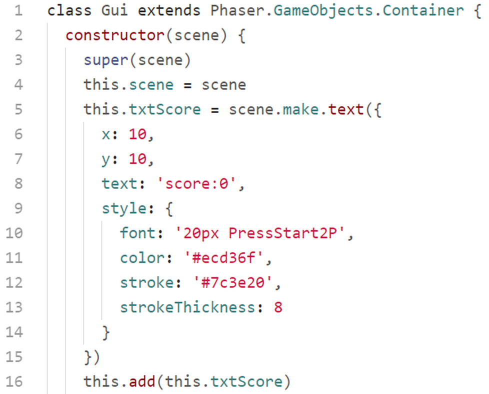
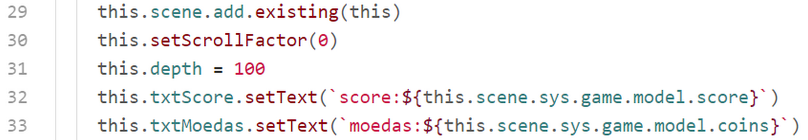
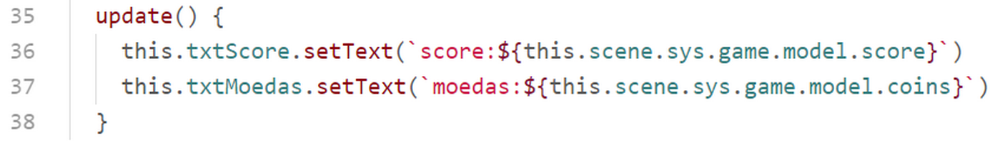

## classes/Inimigo.js

Aqui criamos a classe Inimigo.

Na linha 5 adicionamos o inimigo na scene.

Na linha 17 habilitamos a física no inimigo.

Nas linhas 7 e 8 redefinimos o tamanho do corpo físico para que a colisão ocorra nos pés do inimigo.

Na linha 9 definimos a profundidade do inimigo na scene.

Na linha 10 chamamos o método para criar as animações do inimigo.

### Método ``update()``.

Este método rodará a cada frame pois será chamado pelo ``update()`` da GameScene.

Na linha 14 movemos o inimigo na direção da personagem a cada frame, com uma velocidade de 100 pixels por segundo com o método ``moveToObjects()`` que é fornecido pelo motor de física arcade do Phaser.

Na linha 19 carregamos a animação atual na variável ``animação``.

Na linha 20 calculamos o ângulo de movimento do inimigo por meio do método ``this.body.velocity.angle()``. Este método é fornecido pelo corpo físico do objeto. Na documentação do Phaser você encontrará outros métodos do corpo físico de um objeto.

Nas linhas 21 a 30 definimos qual será a animação aplicada ao inimigo correspondente ao ângulo do movimento.

Nas linhas 32 a 34 aplicamos a nova animação caso a animação atual seja diferente da nova animação.

### Método ``criaAnimacoes()``.

Das linhas 37 a 82 criamos todas as animações que serão utilizadas pelo inimigo.

## classes/Moeda.js

Nesta classe definimos as moedas do game.

Na linha 6 adicionamos a moeda na scene.

Na linha 5 ajustamos a escala da moeda para 150%.

Nas linhas 9 a 16 criamos a animação da moeda, e na linha 19 executamos a animação.

## classes/GrupoMoedas.js

A função dessa classe é criar as moedas nas posições de objetos do layer de objetos do tilemap que foi carregado na linha 31 da classe ``Mundo.js`` (``this.map.getObjectLayer("Moedas")``).

Nas linhas 6 e 7 iteramos no array ``moedas`` e criamos no grupo 1 moedas para cada objeto do array.

## classes/Gui.js

Essa classe é um container responsável por mostrar na tela do game o score e as moedas colhidas. Criamos esta classe herdando de ``Phaser.GameObjects.Container``, que é uma classe do Phaser que serve de container para objetos de exibição.

Nas linhas de 5 a 13 criamos o objeto de texto que mostrará o score do game. Na linha 16 adicionamos esse texto à própria classe.

Da mesma forma nas linhas de 17 a 28 criamos o objeto de texto para mostrar as moedas colhidas e adicionamos na própria classe.

Na linha 29 adicionamos o container na scene, e nas linhas 30 e 31 fixamos o container na scene e definimos a sua profundidade para 100, para garantir que não seja sobreposto por outros objetos da scene.

Nas linhas 32 e 33 colocamos o texto dentro dos objetos.

### Método ``update()``

No método update atualizamos os textos. Esse roda a cada frame do game, pois será chamado a partir do método ``update()`` na classe GameScene.

Todo o código do jogo está nos arquivos fontes do curso. Estudar o código do jogo é uma excelente forma de aprender e fixar os conhecimentos.
