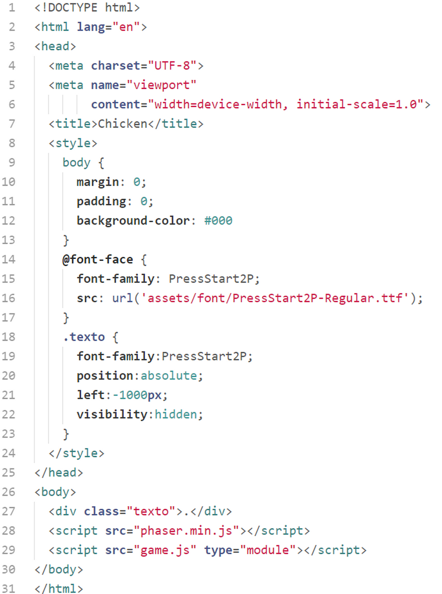
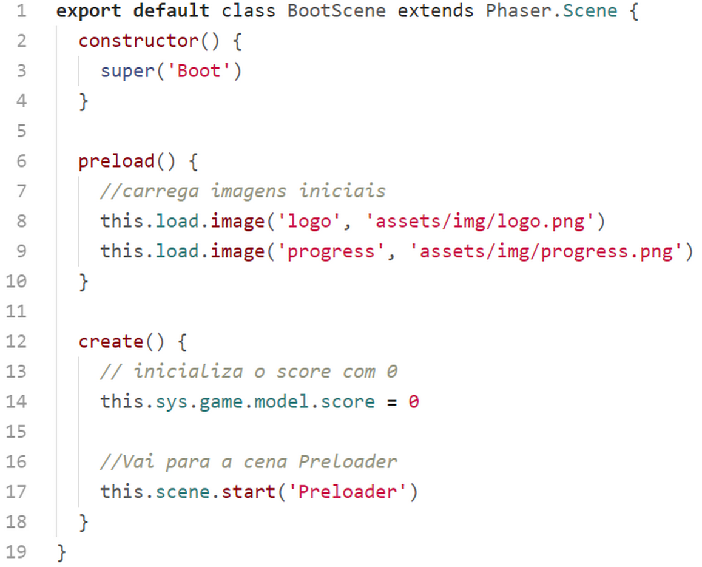

# Chicken

Vamos agora estudar o código de um jogo que tem um tema bastante tradicional. É um jogo onde você tem que conduzir uma galinha para atravessar uma auto estrada enquanto colhe os ovos espalhados pela via.

Primeiramente examinaremos a estrutura de pastas e arquivos. Depois disso, e antes de começarmos estudar o código, é bom você baixar o código fonte e rodar o jogo para conhecê-lo. Isso vai ajudar a compreender melhor o código.

## Estrutura de pastas e arquivos

### ``assets``

Como sempre, nesta pasta encontram-se todos as imagens mapas sons e todos os assets do game.

``assets/atlas``

Nesta pasta temos os arquivos referentes aos textureatlas botoes e vehicles.

``assets/audio``

É onde ficam todos os arquivo de áudio do game.

``assets/font``

Aqui temos o arquivo de fonte que utilizaremos no game.

``assets/img``

Todas as imagens estão aqui.

``assets/map``

Os 2 arquivos referentes ao tilemap do game.

``asssets/spritesheet``

Temos aqui o spritesheet da galinha.

### ``classes``

Nesta pasta temos as classes do game.

### ``config``

Nesta pasta temos o arquivo de configuração do game.

### ``scenes``

Aqui temos as classes que definem as scenes (cenas) do game.

## index.html

Este arquivo é semelhante ao index.html do game Beth, mas vamos analisar as linhas mais importantes.

Na tag ``style`` nós definimos magin e padding para que não fique nenhuma borda no canvas do game. Nesta tag também configuramos e carregamos a fonte a partir do arquivo ``assets/font/PressStart2P-Regular.tff``.

Configuramos também uma classe ``.texto`` que fará com que o texto que utilizaremos somente para carregar efetivamente a fonte e deixá-la disponível para o Phaser fique fora da tela.

Na linha 27 temos a ``div`` com a classe ``texto``.

Na linha 28 carregamos a biblioteca do Phaser e na linha 29 carregamos o nosso arquivo inicial ``game.js``. Acrescentamos o atributo ``type="module"`` para podermos importar nossas classes para o game de forma modular. Sem esse atributo o browser não saberá que estamos trabalhando com módulos javascript.

## game.js

Aqui está o arquivo inicial responsável por carregar as configuração e iniciar o game.

Na primeira linha importamos as configurações do game.
Nas linhas 2 a 6 importamos as scenes (cenas).

Nas linha de 8 a 16 criamos a classe Game que herda de ``Phaser.Game``.

No constructor da classe adicionamos as scenes e iniciamos o game pela scene Boot.

Na linha 20 criamos a variável ``game`` e iniciamos o jogo. Nas linha 22 a 27 anexamos ao game um objeto de dados ``game.model``. Este objeto de dados poderá ser acessado a partis das scenes pelo atalho ``this.sys.game.model``.

No método ``preload()`` carregamos as imagens necessárias para a scene PreloaderScene.

No método ``create()`` inicializamos a o score com zero e partimos para  PreloaderScene.
