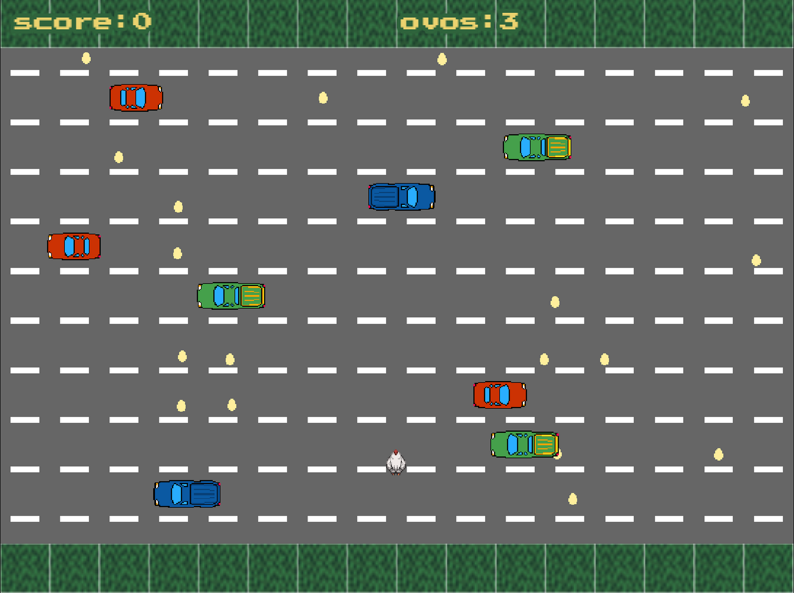
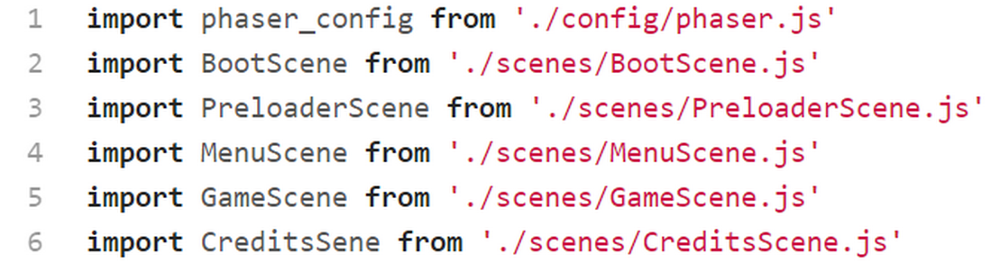
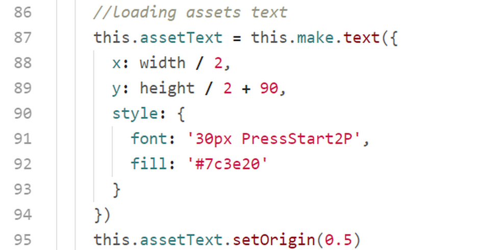
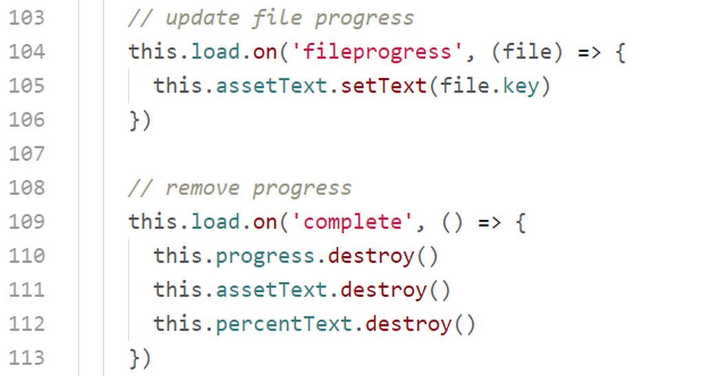
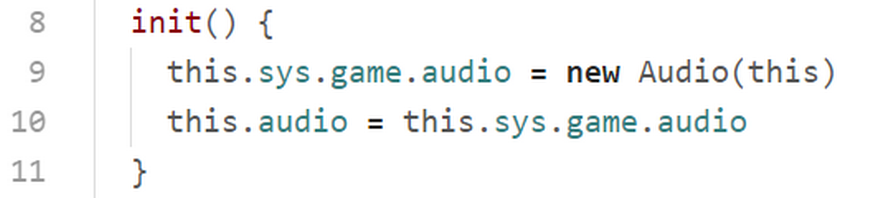
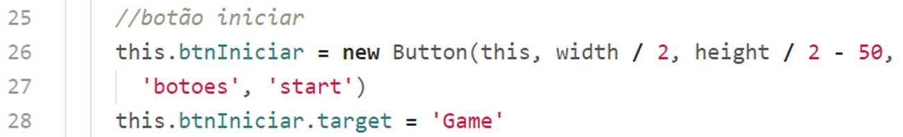

# Chicken

Vamos agora estudar o código de um jogo que tem um tema bastante tradicional. É um jogo onde você tem que conduzir uma galinha para atravessar uma auto estrada enquanto colhe os ovos espalhados pela via.

Primeiramente examinaremos a estrutura de pastas e arquivos. Depois disso, e antes de começarmos estudar o código, é bom você baixar o código fonte e rodar o jogo para conhecê-lo. Isso vai ajudar a compreender melhor o código.

## Estrutura de pastas e arquivos

### ``assets``

Como sempre, nesta pasta encontram-se todos as imagens mapas sons e todos os assets do game.

``assets/atlas``

Nesta pasta temos os arquivos referentes aos textureatlas botoes e vehicles.

``assets/audio``

É onde ficam todos os arquivo de áudio do game.

``assets/font``

Aqui temos o arquivo de fonte que utilizaremos no game.

``assets/img``

Todas as imagens estão aqui.

``assets/map``

Os 2 arquivos referentes ao tilemap do game.

``asssets/spritesheet``

Temos aqui o spritesheet da galinha.

### ``classes``

Nesta pasta temos as classes do game.

### ``config``

Nesta pasta temos o arquivo de configuração do game.

### ``scenes``

Aqui temos as classes que definem as scenes (cenas) do game.

## index.html

Este arquivo é semelhante ao index.html do game Beth, mas vamos analisar as linhas mais importantes.

Na tag ``style`` nós definimos magin e padding para que não fique nenhuma borda no canvas do game. Nesta tag também configuramos e carregamos a fonte a partir do arquivo ``assets/font/PressStart2P-Regular.tff``.

Configuramos também uma classe ``.texto`` que fará com que o texto que utilizaremos somente para carregar efetivamente a fonte e deixá-la disponível para o Phaser fique fora da tela.

Na linha 27 temos a ``div`` com a classe ``texto``.

Na linha 28 carregamos a biblioteca do Phaser e na linha 29 carregamos o nosso arquivo inicial ``game.js``. Acrescentamos o atributo ``type="module"`` para podermos importar nossas classes para o game de forma modular. Sem esse atributo o browser não saberá que estamos trabalhando com módulos javascript.

## game.js

Aqui está o arquivo inicial responsável por carregar as configuração e iniciar o game.

Na primeira linha importamos as configurações do game.
Nas linhas 2 a 6 importamos as scenes (cenas).

Nas linha de 8 a 16 criamos a classe Game que herda de ``Phaser.Game``.

No constructor da classe adicionamos as scenes e iniciamos o game pela scene Boot.

Na linha 20 criamos a variável ``game`` e iniciamos o jogo. Nas linha 22 a 27 anexamos ao game um objeto de dados ``game.model``. Este objeto de dados poderá ser acessado a partis das scenes pelo atalho ``this.sys.game.model``.

No método ``preload()`` carregamos as imagens necessárias para a scene PreloaderScene.

No método ``create()`` inicializamos a o score com zero e partimos para  PreloaderScene.

## scenes/BootScene.js

Está é a a primeira scene do game. A função dessa classe é carregar previamente os assets que serão utilizados na ``PreloadesScene``. No método ``preload()`` estamos carregando apenas o logotipo e a barra de progresso. No método ``create()`` inicializamos o score do game e passamos o controle para a próxima scene.

## scenes/PreloaderScene.js

Aqui carregamos todos os assets do game enquanto mostramos na tela uma barra de progresso, um texto mostrando a porcentagem do carregamento e um texto com o nome do asset que está sendo carregado.

Na primeira linha importamos a classe Animação que será utilizada mais adiante para criar todas as animações do game.

### método ``preload()``

Neste método carregamos todos os assets do game, começando na linha 10 a 13 a carregas os assets relativos ao tilemap.

Carregamos o spritesheet da personagem

Na linha 22 carregamos a imagem que iremos utilizar no ovo.

Na linha 25 carregamos o textureatlas dos botões.

Na linha 29 carregamos o textureatlas dos veículos.

A partir da linha 33 começamos a carregas os sons do game. Como vimos antes cada som carrega 2 arquivos de áudo nos formatos ogg e mp3, para garantir que o browser execute o som.

Nas linhas 63 e 64 pegamos as dimensões da tela.

Nas linha 70 adicionamos a barra de progresso na tela, configurando a sua origem para o topo do lado direito da imagem. Isso fará com que a escala que aplicaremos na imagem comece a partir desse ponto.

Nas linhas 75 a 84 criamos o objeto texto da porcentagem e definimos sua origem para o centro do objeto.

Nas linhas de 86 a 95 criamos o objeto texto dos assets e definimos sua origem para o centro do objeto.

 Nas linhas 98 a 100 escutamos o evento 'progress' onde atualizaremos a escala da barra de progresso e o texto da porcentagem.

 

 Nas linhas 104 a 105 escutamos o evento 'fileprogress' para atualizar o texto dos assets enquanto são carregados.

 Nas linhas 109 a 111 escutamos o evento 'complete' para destruir a barra de progresso, o texto dos assets e o texto da porcentagem.

### método ``create()``

 

 Na linha 118 invocamos a classe responsável por criar toda as animações do game. E depois de meio segundo, na linha 120,  passamos o controle para MenuScene.

## scenes/MenuScene.js

 

 Nas primeiras linha importamos as classes Button e Audio que serão utilizadas adiante para criar os botões do menu e tocar a música de espera.

 ### método ``init()``

 

 Este método é o primeiro a ser executado na scene.

 Na linha 9 instanciamos a classe Audio e salvamos anexamos ao objeto game como ``this.sys.game.audio``. Este objeto estará disponível para todas as scenes como na linha 10.

 ### método ``create()``

 

 Na linha 15 nós paramos a música do jogo.

 Nas linha 16 a 18 tocamos a música de espera passando um objeto de configuração com o volume da música, e habilitando a execução em loop.

 

 Nas linhas 22 e 23 pegamos as dimensões da tela e salvamos nas variáveis constantes ``width`` e ``height``.

 

 Nas linhas 26 e 27 criamos um botão para iniciar o game instanciando a classe Button (estudaremos essa classe detalhadamente mais adiante). Na linha 28 definimos a scene alvo desse botão.

 

 Nas linhas 31 e 32 criamos um botão para acessar a scene dos créditos do game.
