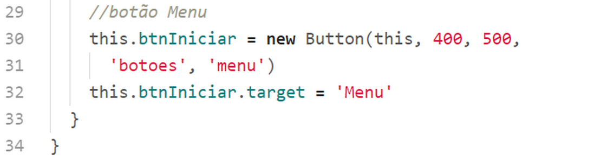
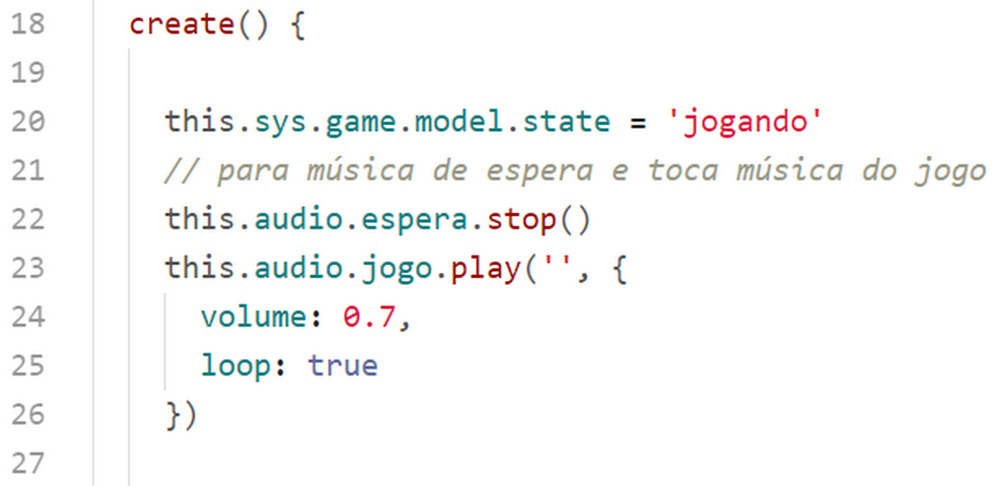
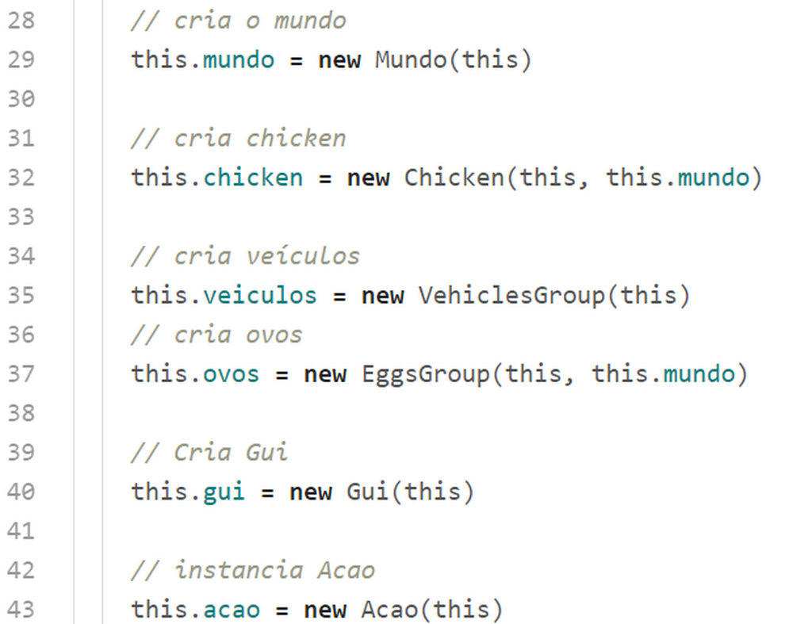
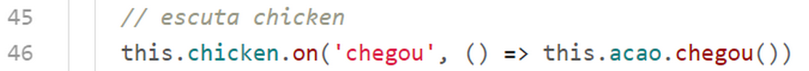
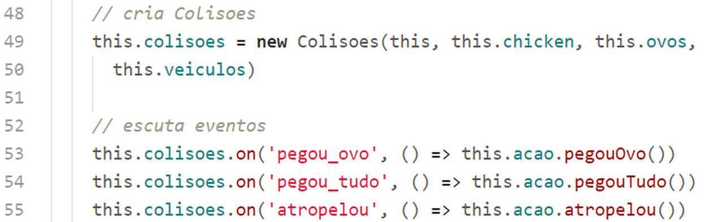
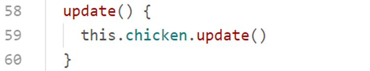
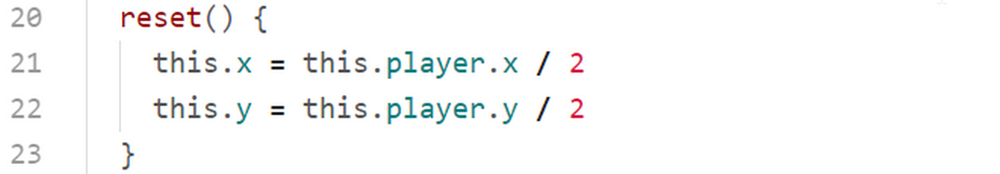
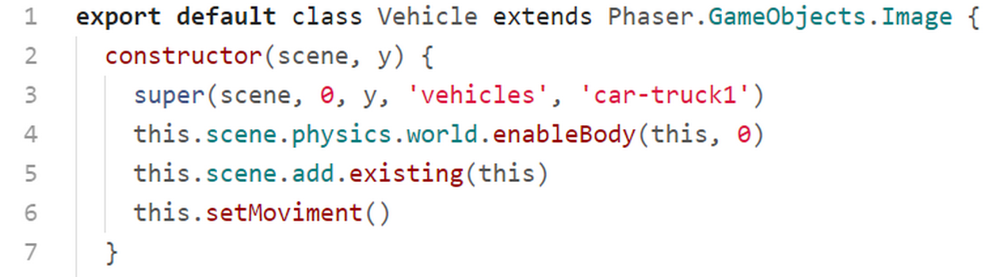
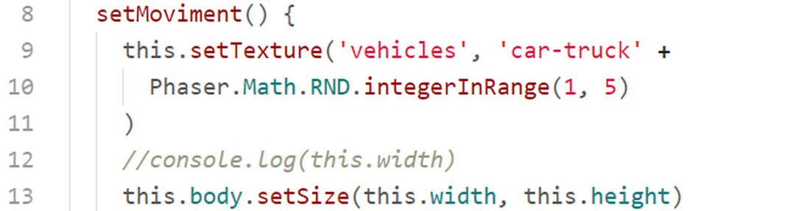
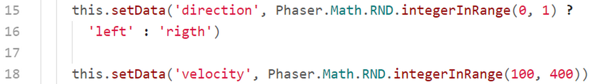

## scenes/CreditsScene.js

Nesta cena apenas apresentamos os créditos do game. E colocamos um botão para voltar ao menu.

Na linha 1 importamos a classe Button.

Na linha 7 recuperamos o objeto de áudio. Nesta scne esse objeto será utilizamos apenas para parar a música.

Na linha 11 paramos a música de espera.

Nas linhas 14 e 15 carregamos, posicionamos e ajustamos a escala do logotipo.

Nas linhas18 a 26 colocamos e posicionamos o texto dos créditos na tela.

Nas linhas 30 a 32 colocamos e posicionamos um botão que quando acionado retorna o controle para MenuScene.

Nesta scene podemos colocar outras informações sobre o game, conforme sua vontade. No lugar do texto poderíamos colocar uma imagem ou até mesmo um sprite animado. Isto que colocamos é apenas um exemplo.

## scenes/GameScene.js

A scene principal do game.

Nas linhas de 1 a 7 importamos todas as classes necessárias. Estas classes serão analisadas individualmente mais adiante.

Na linha 15 recuperamos o objeto de áudio.

Na linha 20 definimos o valor "jogando" para a variável de dados ``this.sys.game.model.state``.

Na linha 22 paramos a música de espera, e nas linhas de 23 a 25 tocamos a música do jogo em loop.

Nas linhas acima instanciamos as classes do game.

Na linha 46 escutamos o evento "chegou", emitido pela classe Chicken, para executarmos this.acao.chegou(). Examinaremos a classe Acao posteriormente.

Nessas linhas escutamos os eventos "pegou_ovo", "pegou_tudo" e "atropelou", executando as ações correspondentes.

(Tratar as ações em uma classe separada facilita a manuntenção e expansão do game)

Na linha 59 executamos o método ``update()`` da classe Chicken a cada frame do game. A classe chicken também será estudada posteriormente.

## classes/Mundo.js

Esta classe tem a responsabilidade de criar o nosso mundo, instanciando o tilemap, os layers e layers de objetos.

Nas linha 4 a 5 instanciamos o mapa na variável ``this.map``.

Na linha 7 adicionamos a imagem "autoestrada", carregada na PreloaderScene, no nosso mapa.

Na linha 8 criamos o leyer estrada na cena.

Na linha 9 reduzimos a escala desse layer para a metade porque, como o nosso mapa tem uma formação de 16 x 12 tiles com 100px cada, o tamanho final desse layer é 1600 x 1200, sendo que as dimensões do nosso game são 800 x 600 px.

Na linha 10 carregamos no variável ``this._player`` o objeto do mapa nomeado por "player" no layer "posicao". Na linha 11 carregamos na variável ``this._arrival`` o objeto do mapa nomeado por "arrival" (chegada).

Na linha  12 carregamos na variável ``this._eggs`` um array com todos os objetos denominados "ovo" do layer "posicao".

Vamos aproveitar o momento e dar uma olhada na construção do tilemap do game.

Utilizamos a ferramenta Tiled para criar o mapa.

Neste mapa fizemos o seguinte:
* Carregamos o tileset "autoestrada.png".
* Criamos o layer "estrada" e o objectlayer "posicao".
* Montamos a estrada.
* Criamos no objetclayer as marcaçãos para o "player", "arrival" (chegada), e as possíveis posições onde um "ovo" pode aparecer.

Abra do Tiled o mapa (está no código fonte) para estudá-lo.

Na linha 15 a 23 criamos métodos get para fornecer acesso às variáveis ``this._player``, ``this._arrival`` e ``this._eggs``.

## classes/Chicken.js

Esta é a classe onde criamos a personagem. Aqui criamos o sprite, capturamos as setas do teclado para alterar o movimento e as animações correspondentes.

Na linha 3 passamos para a classe herdada a posição x e y do player, a textura (spritesheet carregado em PreloaderScene) e o número do frame com o qual iremos iniciar a exibição da personagem.
A posição x e y é dada dividindo-se o valor das variáveis ``mundo.player.x`` e ``mundo.player.y`` por 2. Isso é necessário pois como já vimos o nosso realmente tem o dobro das dimensões da tela do game.

Na linha 5 definimos a variável ``this.arrival`` com o objeto do ponto de chegada da personagem, e na linha 6 temos a definição da variável ``this.player`` com o objeto de posicionamento inicial da personagem.

Na linha 7 adicionamos a personagem à scene.

Nas linhas de 8 a 10 habilitamos um corpo físico para a personagem, habilitamos a colisão com as bordas do mundo para evitar que a personagem ultrapasse os limites do game, e ajustamos o tamanho do corpo físico para melhor efeito da colisão da personagem com os outro objetos.

Na linha 11 definimos a profundidade da personagem na tela como sendo 10.

Na linha 12 criamos um objeto de cursor na variável ``this.cursors`` para capturamos as setas pressionadas.

Na linhas 14 a 16 tocamos o som dos passos em loop e logo em seguida, na linha 18, colocamos os sons dos passos em pausa.

### método ``reset()``

Nas linhas 20 a 23 criamos o método ``reset()`` que servirá para posicionar o player na posição inicial. Os valores divididos por 2 se devem a que, como já vimos, o tamanha original no nosso tilemap é o dobro do tamanho da tela do game.

Na linha 25 definimos inicialmente a velocidade do player como 0 horizontalmente e verticalmente.

Na linha 26 verificamos se o game está em algum estado diferente de "jogando", caso afirmativo pausamos o som dos passos, definimos a animação da personagem para "frente" e abandonamos o resto do método ``update()``.

Nas linha 32 e 33 emitimos o evento "chegou" caso a personagem tenha alcançado a posição de chegada.

Da linha 36 em diante definimos o movimento e as animações da personagem conforme a seta do teclado pressionada. Também voltamos a tocar a som dos passos.

Se nenhuma seta está pressionada definimos a velocidade com 0, pausamos o som dos passos e ajustamos a animação da personagem conforme o valor de ``this.getData('direcao')`` que definimos no bloco anterior com a ajuda do método ``this.setData('direcao', direcao)``

## classes/Vehicle.js

Está é a classe onde definimos os objetos dos veículos.

Na linha 3 chamamos a classe hedada passando como parâmetro a scene, a posição x e y, a textura do textureatlas 'vehicles' e a textura inicial do veículo.

Na linha 4 habilitamos o corpo físico do veículo e na linha 5 adicionamos o veículo na cena (GameScene).

E, fechando o método constructor, chamamos o método ``this.setMoviment()`` estudado adiante.

### método ``setMoviment()``

Este método é responsável por:
* Definir aleatoriamente a textura do veículo ('car-truck1' a 'car-truck5').
* Ajustar o tamanho do corpo físico conforme o tamanho da textura.
* Definir aleatoriamente a direção do veículo.
* Ajustar o flip em X conforme a diração definida.
* Definir aleatoriamente a velocidade do veículo.

Na linha 9 definimos aleatoriamente a textura concatenando a string 'car-truck' com um número entre 1 e 5 fornecido pelo método ``Phaser.Math.RND.integerInRange(1, 5)``. Este método é um helper do Phaser. Procure saber mais sobre ele na documentação do Phaser procurando por ``Phaser.Math.RND``.

Na linha 13 ajustamos o tamanho do corpo físico conforme o tamanho da textura escolhida.

Na linha 15 definimos uma direção aleatoriamente e na linha 18 definimos uma velocidade aleatoria também.

Nas linhas 20 a 27 ajustamos a posição horizontal do veículo de acordo com a direção do mesmo.

### Método ``update()``

No método ``update()`` redefinimos o veículo caso tenha ultrapassado o lado esquerdo ou direito da tela, executando novamente o método ``this.setMoviment()``.

