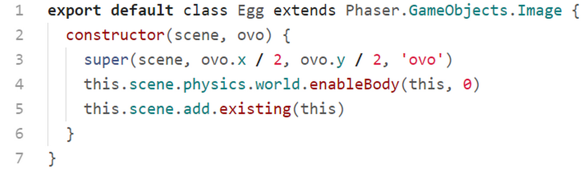
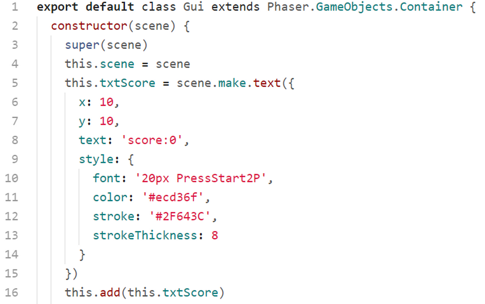
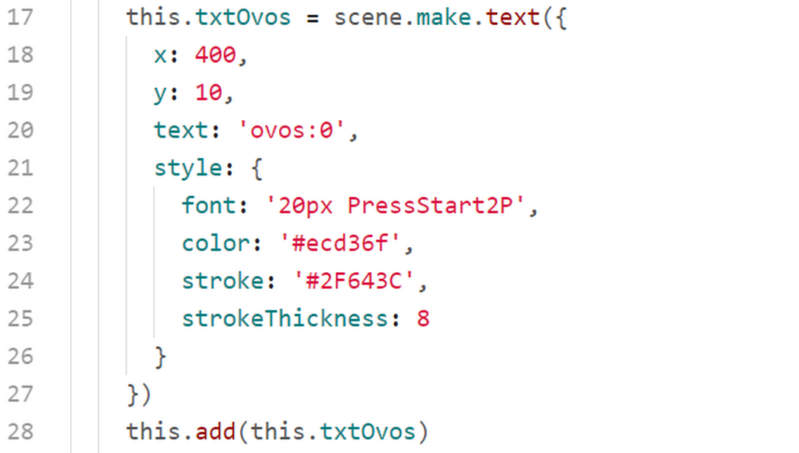
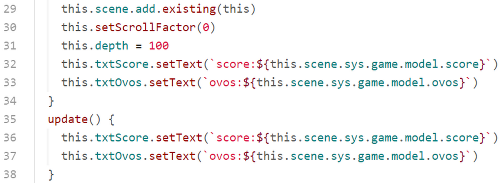
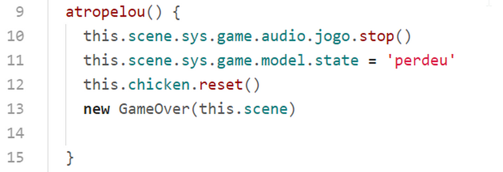
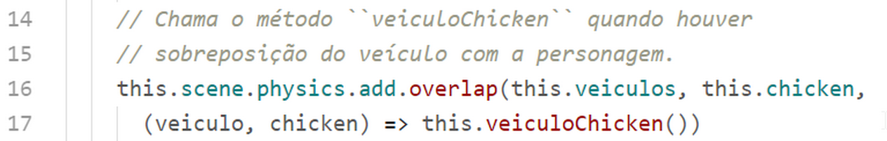
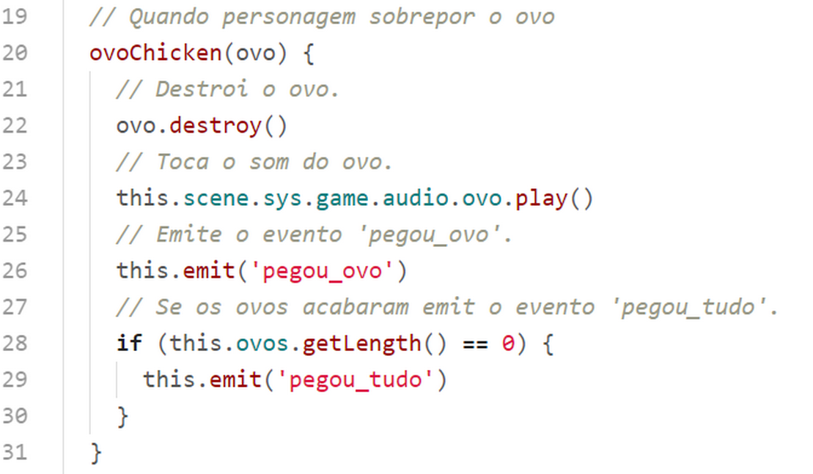
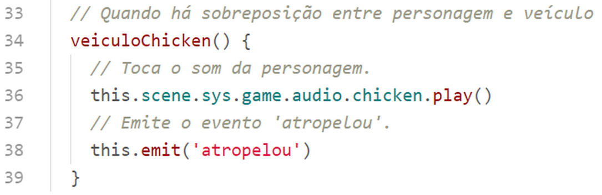
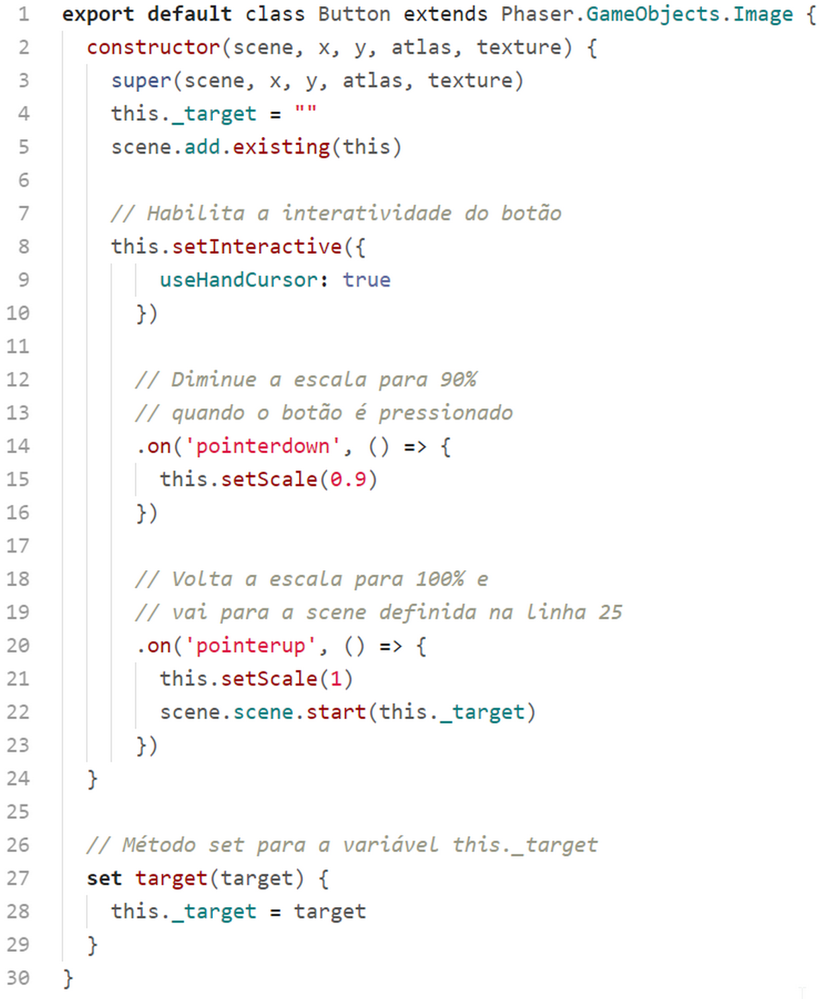

## classes/VehiclesGroup.js

Nesta classe instanciamos 9 veículos e adicionamos os mesmos dentro do grupo.

Na figura seguinte temos a tela do game com a posição dos 9 veículos.

Voltando ao código. Na linha 4 chamamos a classe herdada passando como parâmetros o mundo físico e a scene.

Na linha 5 adicionamos o grupo da scene.

Na linha 6 habilitamos que o método ``this.update()`` desta classe rode a cada frame do game.

Nas linhas 7 e 8 criamos e adicionamos ao grupo 9 veículos com posições y variando de 100 a 500px.

Na linha 10 chamamos o método ``this.setDepth(200, 1)`` este método definirá a profundidade dos veículos deste grupo a partir de 200, incrementando 1 para cada veículo. Então a profundidade dos veículos será: 200, 201, 202, 203, 204, 205, 206, 207, 208.

### classes/Egg.js

Nesta classe definimos a imagem do ovo.

Na linha 3 chamamos a classe herdada passando a scene, a posição x e y do ovo, e a imagem do ovo carregada na PreloaderScene.

Na linha 4 habilitamos o corpo físico do ovo para que a personagem possa colidir com o mesmo.

Na linha 5 adicionamos o ovo na scene.

### classes/EggsGroup.js

Esta classe é responsável por espalhar os ovos pela scene do game.

Comentaremos apenas o método ``reset()``. Este método quando é chamado primeiramente "limpa" o grupo apagando todos os ovos.

Na linha 13 nós carregamos na variável ``ovos`` um array com a posição dos ovos embaralhados (com o helper ``Phaser.Math.RND.suffle``). O array ``this.mundo.eggs`` vem do objectlayer "posicao" no tilemap.

Na linha 14 definimos que colocaremos na tela apenas 20 ovos, ignorando o resto. Como o array foi embaralhado aleatoriamente, esses 20 ovos ocuparam posições aleatórias.

Na linha 15 instanciamos a classe ``Egg`` dentro do grupo.

### classes/Gui.js

Esta é a classe, que herda de ``Phaser.GameObjects.Container``, exibe o score e a quantidade de ovos capturados.

A classe pai, ``Phaser.GameObjects.Container``, é um container de objetos de exibição. É muito útil para agrupar objetos de exibição de forma a controlar suas posições relativa por meio da posição do container.

Nas linhas de 5 a 13 criamos um objeto de texto ``this.txtScore`` definindo a fonte "PressStart2P" com tamanho 20px, definimos também uma cor para o texto, uma cor para o contorno e a cor do contorno.

Na linha 16 adicionamos o objeto ao container.

 Nas linhas de 17 a 25 criamos um objeto de texto ``this.txtOvos`` definindo a fonte "PressStart2P" com tamanho 20px, definimos também uma cor para o texto, uma cor para o contorno e a cor do contorno.

 Na linha 28 adicionamos o objeto no container.

 

 Na linha 29 adicionamos o container na scene.

 Na linha 30 definimos o fator de scroll como 0 (como nosso map é do mesmo tamanho da tela e a nossa câmera não de move, esta linha pode ser suprimida).

 Na linha 31 definimos a profundidade do container como 100 para garantir que não será sobreposto por outro objetos na scene.

 Nas linhas 32 e 33 imprimimos os textos na tela.

 ### Método ``update()``

 Este método será adicionado posteriormente ao método ``update()`` da GameScene.

 ## classes/Acao.js

 Esta classe é responsável por tratar as ações necessárias no jogo.

 

 Na linha 1 importamos a classe GameOver que veremos mais adiante.

 Nas linhas 5 a 7 carregamos as variáveis ``this.gui``, this.ovos`` e ``this.chicken`` com os objetos correspondentes a partir do parâmetro ``scene``. Para que isso ocorra é necessário que a esta classe seja instanciada após as classes Gui, Ovos e Chicken, na GameScene.

 

 Nas linhas de 9 a 13 tratamos a ação "atropelou".

 Primeiramente paramos a música do jogo. Em seguida mudamos a variável ``this.scene.sys.game.model.state`` para "perdeu".

 Na linha 12 chamamos o método ``this.chicken.reset()`` já estudado anteriormente.

 Na linha 13 instanciamos a classe GameOver que é responsável por colocar na tela alguns objetos de exibição como textos e um botão para reiniciar e outro para voltar ao MenuScene.

 

 No método ``pegouOvo()`` atualizamos as variáves de dados e a gui do game.

 

 O método ``pegouTudo()`` ainda não tem nenhuma lógica implementada. Você pode aproveitar e criar alguma coisa aqui.

 

No método ``chegou()`` tocamos a música de vitória e implementamos a seguinda lógica para somar pontos:
* O jogador só pontua se colheu ovos.
* Quanto mais ovos colhidos, maior é a pontuação.
* Na pontuação existe um fator aleatório para quebrar a pontuação em valores unitários.

Na linha 29 chamamos o método ``this.ovos.reset()`` que vem da classe EggsGroup. Da mesma forma na linha 30 chamamos a classe ``this.chicken.reset()``, e na linha 31 atualizamos a gui.

## classes/Colisoes.js

Esta classe, como o nome sugere, trata as colisões entre os objetos do game.

Nas linha 5 a 7 carregamos nas variáveis ``this.chicken``, ``this.ovos`` e ``this.veiculos`` os objetos correspondentes passados por parâmetro. Lembrando que ``ovos`` e ``veiculos`` são grupos, e ``chicken`` é um objeto só.

Nas linhas 11 e 12 chamamos o método ``this.ovoChicken(ovo)`` quando houver sobreposição entre a personagem e o vo.

Nas linha 16 a 17 idem.

### Método ``ovoChicken()``

Este método trata a sobreposição da personagem com o ovo.

Na linha 22 o ovo é destruído e na linha 24 tocamos o som do ovo.

Na linha 26 emitimos o evento 'pegou_ovo'.

Se os ovos acabaram emitimos o evento 'pegou_tudo' na linha 29.

### Método ``veiculoChicken()``.

Toca o som da personagem na linha 36, e na linha 38 emite o evento 'atropelou'.

## classes/Animacoes.js

Nesta classe criamos todas as animações do game e não necessita comentários. Abra o arquivo para ver mais.

## classes/Audio.js

Nesta classe criamos todos os objetos de áudio do game.

## classes/Button.js

Nesta classe criamos o botão que será instanciado em algumas scenes.

Na linha 5 adicionamos o botão na scene.

Nas linhas 8 e 9 habilitamos a interatividade, para que o botão responda aos eventos do mouse.

Nas linhas 14 e 15, quando o botão é pressionado, diminuímos a sua escala para 90%.

Nas linhas 21 e 22, quando o botão é solto, voltamos a escala para 100% e chamamos a scene alvo.

Nas linhas 27 e 28 criamos o setter para a variável this._target.
